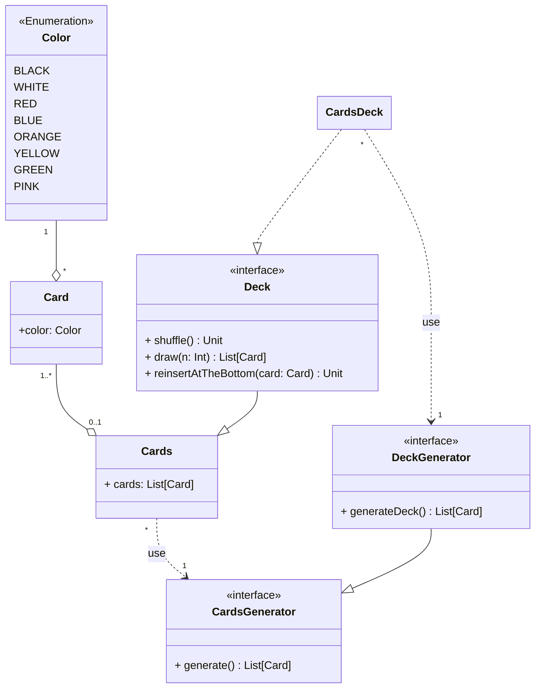

---

title: Cards
nav_order: 1
parent: Design di dettaglio

---

# Modellazione carte e mazzo di carte

L'entità carta, intesa come carta vagone, è caratterizzata da un colore. Le carte vengono gestite in un'entità base `Cards`,
che modella una lista di carte; questa viene estesa per realizzare il concetto di mazzo di carte (`Deck`), ma consentendo
anche una facile creazione di altre entità che consistono in una lista di carte, per esempio la mano dei giocatori.
Una lista di carte, quindi anche un mazzo, viene creato tramite un generatore, che viene realizzato come un decoratore,
tramite l'ausilio dei _mixin_.

