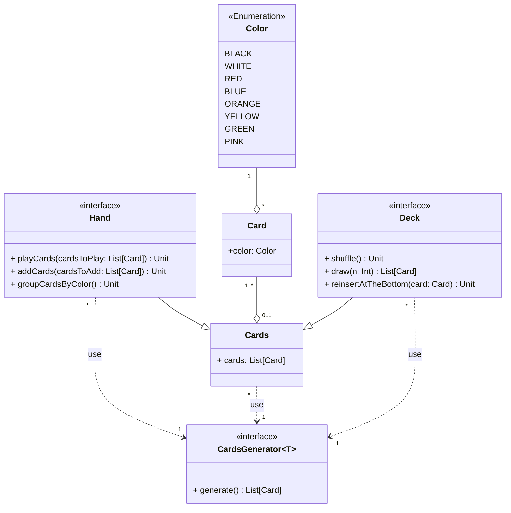

---

title: Cards
nav_order: 1
parent: Design di dettaglio

---

# Modellazione carte

L'entità carta, intesa come carta vagone, è caratterizzata da un colore. Le carte vengono gestite in un'entità base `Cards`,
che modella una lista di carte; questa viene estesa per realizzare i concetti di mazzo di carte (`Deck`) e mano del
giocatore (`Hand`), ma consentendo anche una facile creazione di altre entità che consistono in una lista di carte.
Una lista di carte, quindi anche un mazzo e una mano del giocatore, viene creata tramite un generatore generico,
che può essere realizzato per creare per esempio un'istanza di `Deck` o di `Hand`.
Le entità forniscono un'implementazione di default del generatore, che viene utilizzata nel caso in cui non ne venga
specificata un'altra.

