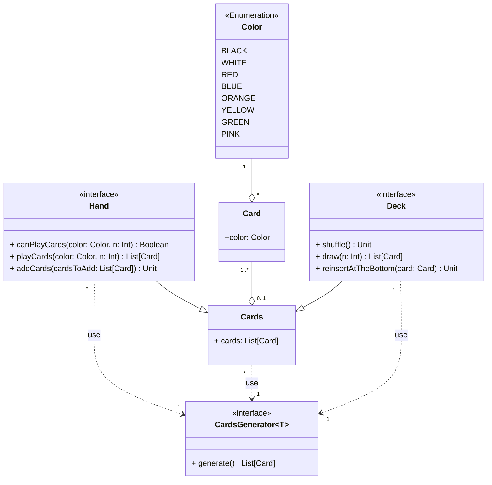

---

title: Cards
nav_order: 1
parent: Design di dettaglio

---

# Modellazione carte

## Card

L'entità `Card`, intesa come carta vagone, è caratterizzata da un colore. Le carte vengono gestite in un'entità base
`Cards`, che modella una lista di carte.

## Deck

Il concetto di `Deck` rappresenta il mazzo di carte vagone e con il quale è possibile effettuare tre azioni: mischiare,
pescare un qualsiasi numero positivo di carte e reinserire una carta in fondo.
Il mazzo di carte viene realizzato estendendo la lista di carte `Cards`.

## Hand

Il concetto di `Hand` rappresenta la mano del giocatore, la quale è composta da un insieme di carte vagone; le azioni
che la riguardano consistono nel verificare la possibilità di giocare un numero di carte di un determinato colore,
nell'aggiungere una lista di carte e giocare una lista di carte presenti nella mano specificando il numero di carte di
un determinato colore.

## CardsGenerator

Si tratta di un generatore di una lista di carte (`Cards`), il quale viene definito come generico, in questo modo per
esempio è possibile realizzare una sua istanza per il `Deck` ed una per l'`Hand` del giocatore.
Le entità come `Deck` e `Hand` forniscono un'implementazione di default del generatore, la quale viene utilizzata nel
caso in cui non ne venga specificata un'altra.

