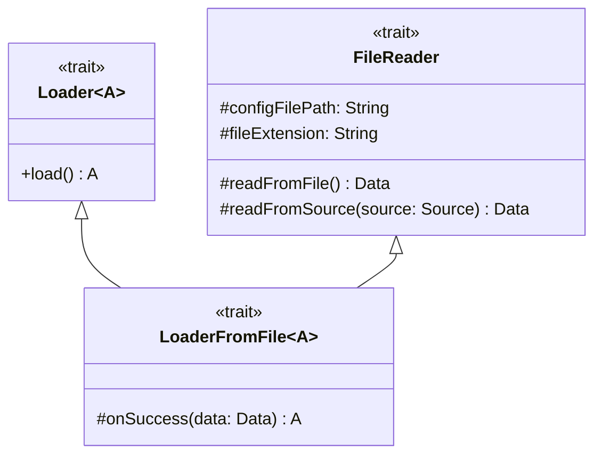

---

title: Loader
nav_order: 3
parent: Design di dettaglio

---

# Design di dettaglio - Loader

# Loader
`Loader` è un trait che descrive un generico caricatore di dati. Possiede un unico metodo per effettuare il caricamento,
il quale ha come tipo di ritorno il tipo parametrico `A`, rappresentante il tipo di dato caricato.

# FileReader
`FileReader` è un trait che descrive un lettore di file. Possiede solo metodi protetti, usati per leggere dati da file,
ed è pensato per essere un trait di supporto da utilizzare in maniera nascosta, per non esporre dettagli implementativi
collegati alla lettura da file.

# LoaderFromFile
`LoaderFromFile` è un trait che descrive un caricatore di dati letti da file. Estende `Loader` e `FileReader` ed
introduce il metodo protetto `onSuccess` che specifica le azioni da eseguire in seguito alla lettura da file, per
ottenere i dati di tipo `A`.