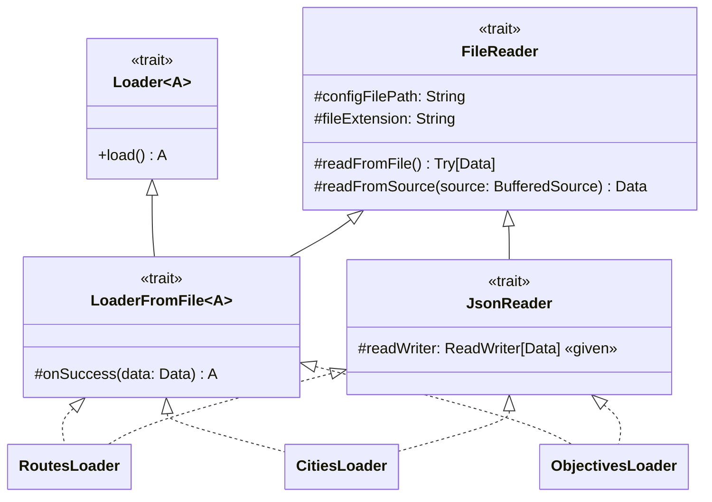

---

title: LoaderImpl
nav_order: 1
parent: Implementazione

---

# Implementazione - Loader

```mermaid
---
config:
  class:
    hideEmptyMembersBox: true
---
classDiagram
    class Loader~A~ {
        <<trait>>
        +load() A
    }
    class FileReader {
        <<trait>>
        #configFilePath: String
        #fileExtension: String
        #readFromFile() Try[Data]
        #readFromSource(source: BufferedSource) Data
    }
    class LoaderFromFile~A~ {
        <<trait>>
        #onSuccess(data: Data) A
    }
    class JsonReader {
        <<trait>>
        #readWriter: ReadWriter[Data] «given»
    }
    Loader <|-- LoaderFromFile
    FileReader <|-- LoaderFromFile
    FileReader <|-- JsonReader
    LoaderFromFile <|.. RoutesLoader
    JsonReader <|.. RoutesLoader
    LoaderFromFile <|.. CitiesLoader
    JsonReader <|.. CitiesLoader
    LoaderFromFile <|.. ObjectivesLoader
    JsonReader <|.. ObjectivesLoader
```