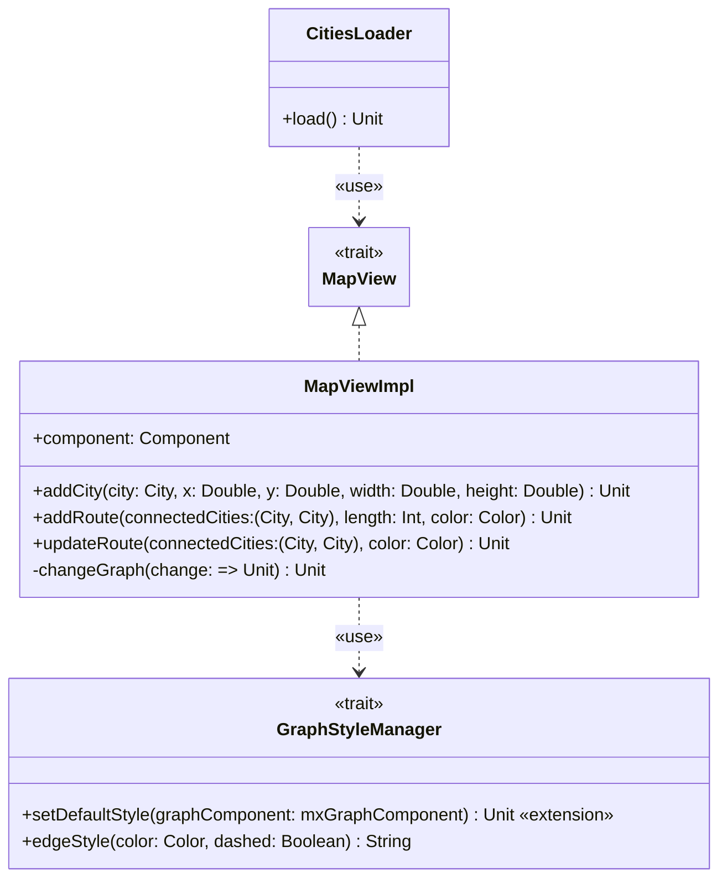

---

title: MapView
nav_order: 5
parent: Implementazione

---

# Implementazione - MapView

## CitiesLoader

`CitiesLoader` è la classe che viene utilizzata per caricare le città all'interno della `MapView`. Per fare ciò invoca
il metodo `addCity` di `MapView` per ogni città da aggiungere. Maggiori dettagli sull'implementazione interna di
`CitiesLoader` sono forniti nella sezione "loader".

## MapViewImpl

`MapViewImpl` è l'implementazione di default di `MapView`, restituita dal metodo `apply` contenuto nel companion object
di `MapView`. E' un object, inteso come **singleton**, in quanto nel gioco deve essere presente una sola istanza di
`MapView`. Considerando che la scelta implementativa per la *view* è quella di utilizzare la libreria **Scala Swing**
(wrapper di **Java Swing**), anche in questa implementazione la si utilizza. Inoltre, per rappresentare la mappa di
gioco, che è composta da città collegate da tratte ferroviarie, e quindi è un grafo, si utilizza la libreria
**JGraphX**, che è basata su **Java Swing** e permette di rappresentare grafi.

`MapViewImpl` contiene quindi il grafo (di tipo `mxGraph`), il relativo componente Swing, e una `Map` da nomi di città
a vertici per poter recuperare un arco dati due nomi di città. Utilizza inoltre un `GraphStyleManager` per impostare lo
stile di default del grafo e ottenere i nuovi stili degli archi da inserire o modificare. Oltre al metodo `addCity`,
citato precedentemente, implementa i metodi `addRoute` e `updateRoute`. `addRoute` si occupa di aggiungere una nuova
route (ovvero un nuovo arco) al grafo, e serve in fase di configurazione per la creazione della mappa (ovvero del
grafo). `updateRoute`, invece, aggiorna una route (ovvero un arco) esistente nel grafo (ottenibile tramite la coppia di
città collegate, grazie alla `Map` prima citata), modificandone lo stile; viene invocato durante il corso del gioco e
serve per marcare una route (ovvero un arco) come "occupata". Si è scelto di rappresentare una route non ancora occupata
tramite una linea tratteggiata del colore della route, e una route occupata tramite una linea continua del colore del
player che la occupa.

Nella libreria JGraphX le modifiche al grafo vanno effettuate con attenzione, segnalandone l'inizio e la fine tramite
metodi appositi. Per facilitare questa operazione ed evitare ripetizioni di codice, è stato introdotto un metodo privato
incaricato di racchiuderne la gestione. Questo metodo è `changeGraph` e prende in input il parametro `change` come
**call-by-name** (`=> Unit`), che rappresenta le azioni da eseguite come cambiamento, le quali sono pertanto eseguite
solo nel punto necessario.

### Interazioni con l'utente

La mappa, così come rappresentata da `MapViewImpl`, dal punto di vista dell'utente deve apparire come un grafo statico,
ovvero con nodi e archi in posizione fissa, ed etichette fisse (l'etichetta di un nodo è il nome della città,
l'etichetta di un arco è la lunghezza della route). Per questa ragione qualunque interazione col grafo viene
disabilitata. L'unica azione che l'utente, ovvero un giocatore, può effettuare, è cliccare su un arco, ovvero una route,
nel tentativo di occuparla. Per tale motivo viene quindi inserito un **listener**, in grado di segnalare l'intenzione di
un giocatore di occupare una determinata route al `GameController`.

### Note sulla libreria JGraphX

Nel corso dell'utilizzo della libreria JGraphX sono emerse alcune strenezze nella sua gestione dei tipi. E' emerso che
la libreria lavora con i vertici e con gli archi trattandoli come oggetti di tipo `Object` (`java.lang.Object`) nei
parametri di input dei suoi metodi, così come nei tipi di ritorno. Si è però scoperto che internamente sia i vertici
che gli archi sono di tipo `mxCell`. Si è quindi deciso, per mantenere un minimo livello di type checking, di
effettuarne il cast a `mxCell` (in quanto safe). Da segnalare inoltre che nell'inserire un nuovo arco è necessario
passare una stringa `null` per segnalare l'assegnamento automatico degli ID. Nel tentativo di rendere più trasparente e
chiaro tale significato, nel metodo `addRoute` è stata introdotta una `val AutomaticId: String = null`.