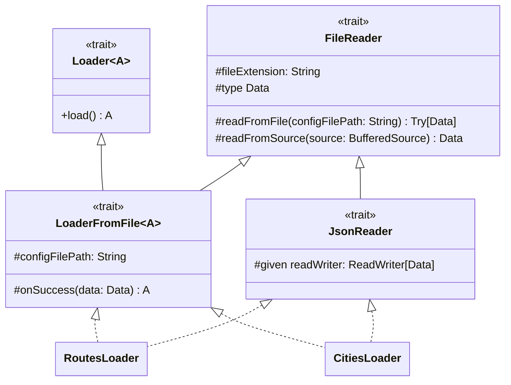

---

title: Loader
nav_order: 3
parent: Design di dettaglio

---

# Design di dettaglio - Loader

```mermaid
---
config:
  class:
    hideEmptyMembersBox: true
---
classDiagram
    class Loader~A~ {
        <<trait>>
        +load() A
    }
    class LoaderFromFile~A~ {
        <<trait>>
        #configFilePath: String
        #onSuccess(data: Data) A
    }
    class FileReader {
        <<trait>>
        #fileExtension: String
        #type Data
        #readFromFile(configFilePath: String) Try[Data]
        #readFromSource(source: BufferedSource) Data
    }
    class JsonReader {
        <<trait>>
        #given readWriter: ReadWriter[Data]
    }
    Loader <|-- LoaderFromFile
    FileReader <|-- LoaderFromFile
    FileReader <|-- JsonReader
    LoaderFromFile <|.. RoutesLoader
    JsonReader <|.. RoutesLoader
    LoaderFromFile <|.. CitiesLoader
    JsonReader <|.. CitiesLoader
```

[TODO descrizione]: #