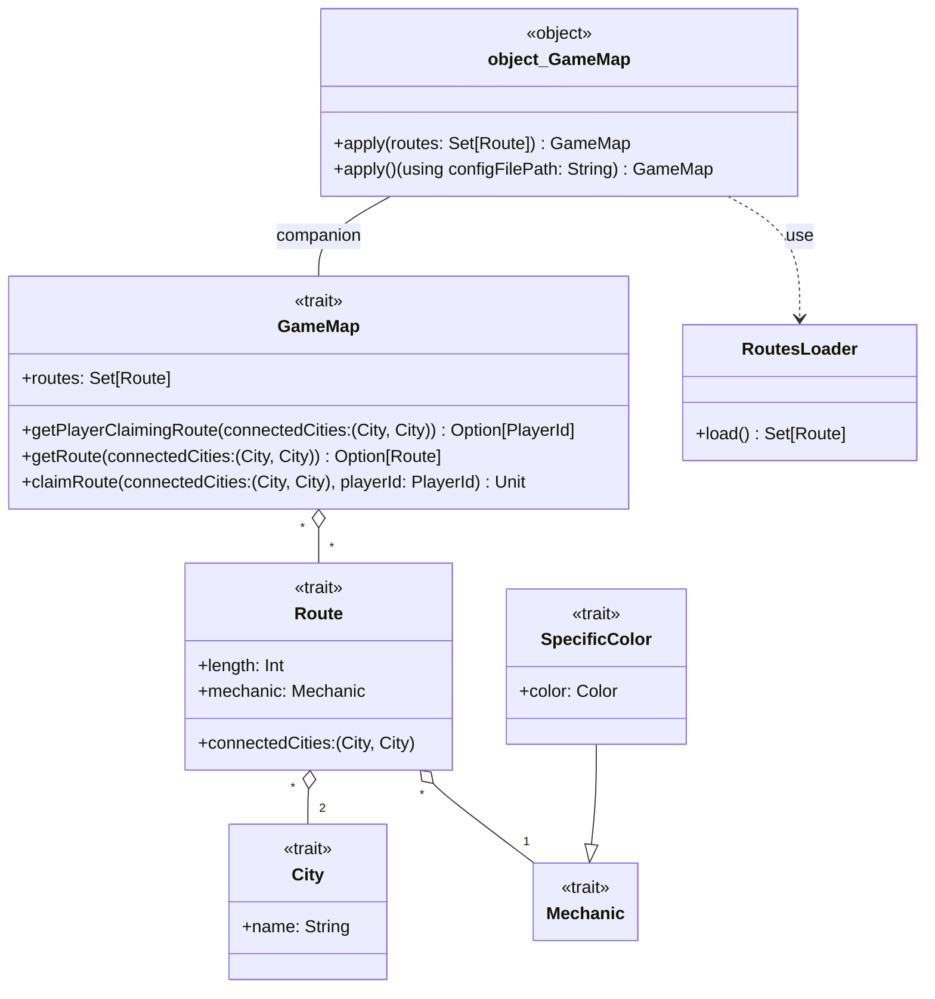

---

title: Map
nav_order: 2
parent: Design di dettaglio

---

# Design di dettaglio - Mappa di gioco

```mermaid
---
config:
  class:
    hideEmptyMembersBox: true
---
classDiagram
    class City {
        <<trait>>
        +name: String
    }
    class Route {
        <<trait>>
        +connectedCities: (City, City)
        +length: Int
        +mechanic: Mechanic
    }
    %% Route.Mechanic
    class Mechanic {
        <<trait>>
    }
    %% Route.SpecificColor
    class SpecificColor {
        <<trait>>
        +color: Color
    }
    class GameMap {
        <<trait>>
        +routes: Set[Route]
        +getPlayerClaimingRoute(connectedCities: (City, City)) Option[PlayerId]
        +getRoute(connectedCities: (City, City)) Option[Route]
        +claimRoute(connectedCities: (City, City), playerId: PlayerId) Unit
    }
    class object_GameMap {
        <<object>>
        +apply(routes: Set[Route]) GameMap
        +apply()(using configFilePath: String) GameMap
    }
    class RoutesLoader {
        +load() Set[Route]
    }
    Route "*" o-- "2" City
    Route "*" o-- "1" Mechanic
    SpecificColor --|> Mechanic
    GameMap "*" o-- "*" Route
    object_GameMap -- GameMap: companion
    object_GameMap ..> RoutesLoader: use
```

[TODO descrizione]: #
