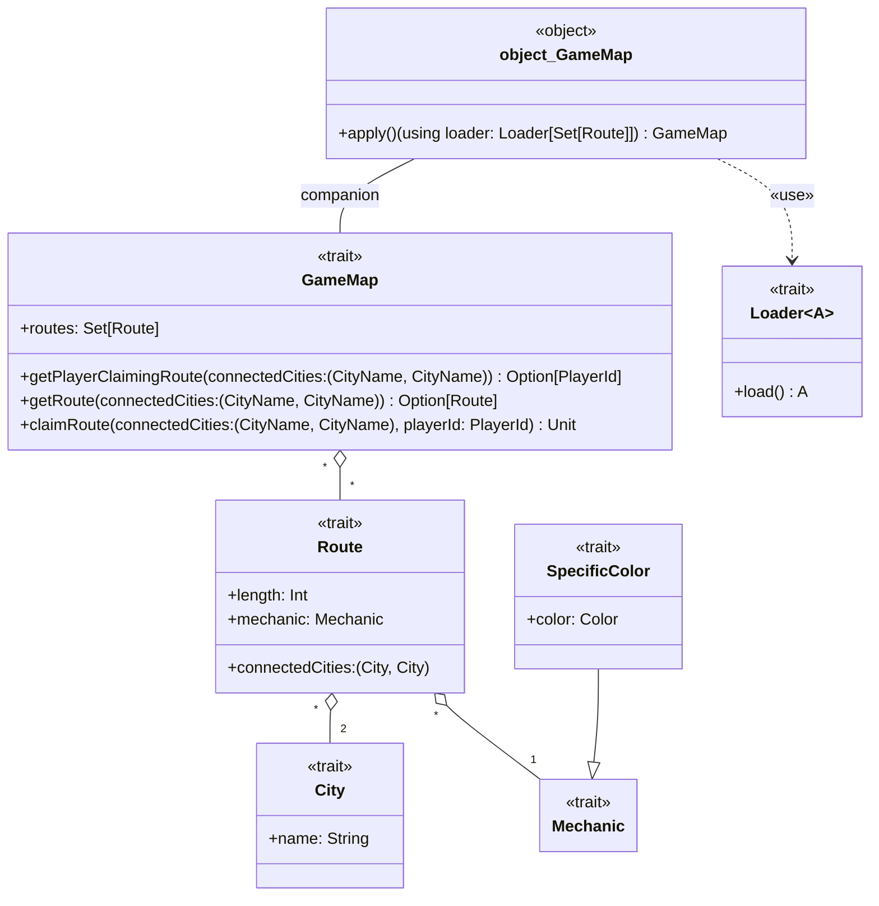

---

title: Map
nav_order: 2
parent: Design di dettaglio

---

# Design di dettaglio - Mappa di gioco

## City

`City` è un trait che descrive una città, caratterizzata da un nome. Il concetto di `City` è stato modellato come trait
per sottolinearne l'importanza che ricopre nel dominio e per dare la possibilità di fornire diverse implementazioni
laddove necessario, lasciando anche la possibilità di estendere il concetto, aggiungendo caratteristiche e/o
comportamenti.

## Route, Mechanic e SpecificColor

`Route` è un trait che descrive una tratta ferroviaria. Non fornendo metodi per modificarne lo stato, è pensato per
modellare una `Route` immutabile. Una `Route` è identificabile tramite la coppia di `City` che collega, e possiede due
caratteristiche: la lunghezza della tratta e la meccanica che segue.

La meccanica è modellata tramite il trait `Mechanic`, che può essere esteso per creare un insieme di meccaniche
differenti. `SpecificColor` ne è un esempio: estende `Mechanic` e definisce la meccanica per cui una `Route` è di un
certo colore. Ulteriori meccaniche sono possibili, e modellate in questo modo permettono anche di essere composte le une
con le altre (ad esempio si può utilizzare `SpecificColor` come mixin per creare una meccanica più complessa che
presenta anche il fatto per cui una `Route` è di un certo colore).

## GameMap e uso di Loader

`GameMap` è un trait che descrive la mappa di gioco, composta da un insieme di `Route`. La `GameMap` permette di:
ottenere l'insieme delle `Route` di cui è composta, ottenere una determinata `Route`, occupare una determinata `Route` o
sapere quale player la occupa. Il companion object di `GameMap` deve permettere la creazione della mappa utilizzando
un `Loader` di `Set[Route]`, il cui scopo è quello di caricare l'insieme delle`Route` di cui si comporrà la mappa.

La `GameMap` risulta immutabile per quanto rigurda l'insieme delle `Route` e mutabile nell'assegnazione dei player alle
`Route`. Considerando il metodo che restituisce una determinata `Route`, si denota l'importanza di avere modellato la
`Route` come immutabile, cosicchè nessuno possa modificare impropriamente la `Route` ottenuta.