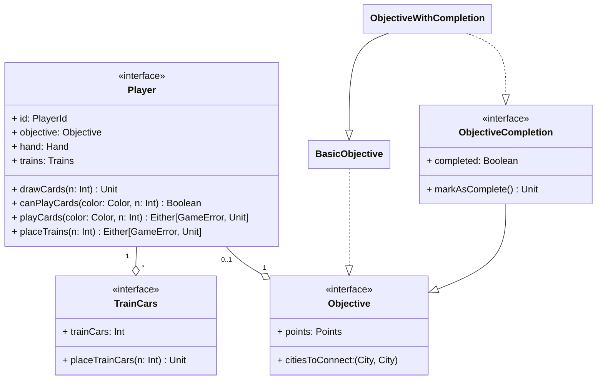

---

title: Player
nav_order: 2
parent: Design di dettaglio

---

# Modellazione giocatore

L'entità giocatore (`Player`), è caratterizzata da un identificatore, un obiettivo da raggiungere, un insieme di vagoni
da utilizzare per occupare delle tratte sulla mappa e una mano composta da carte vagone.
Inoltre, il giocatore ha la possibiltà di pescare delle carte dal mazzo per aggiungerle alla propria mano e di
tentare di occupare una tratta della mappa, posizionando su di essa un numero di vagoni pari alla lunghezza della tratta;
per farlo verifica che abbia a disposizione nella propria mano una quantità sufficiente di carte del colore della tratta
e in caso positivo può procedere giocando le carte e quindi con il piazzamento dei vagoni.
Al giocatore viene assegnato un obiettivo, che è costituito da una coppia di città da collegare ed una quantità di punti
che viene assegnata in caso di completamento o altrimenti rimossa. L'obiettivo base viene decorato tramite **mixin** con
il concetto di completamento, ovvero con la possibilità di osservare il suo stato di completamento e di marcarlo come
completato.

