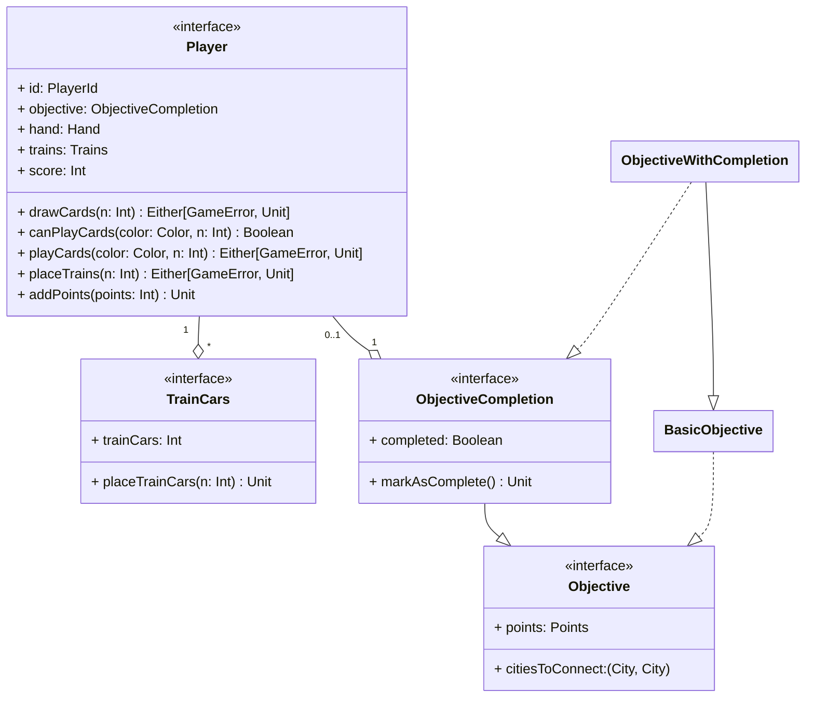

---

title: Player
nav_order: 2
parent: Design di dettaglio

---

# Modellazione giocatore

## Player

L'entità `Player` rappresenta il giocatore, la quale è caratterizzato da un identificatore, un obiettivo da raggiungere,
un insieme di vagoni da utilizzare per occupare delle tratte sulla mappa, una mano composta da carte vagone, pescate
dal mazzo e giocate per occupare le tratte ed il punteggio. Il giocatore può effettuare varie azioni: pescare delle
carte dal mazzo per aggiungerle alla propria mano, verificare la possibilità di giocare un numero di carte di un
determinato colore, giocare un numero di carte dalla propria mano di un determinato colore, piazzare una quantità di
vagoni sulla mappa di gioco e aggiungere un numero di punti al proprio punteggio.
I metodi `drawCards`, `playCards` e `placeTrains` contemplano la possibilità di restituire un errore, tra quelli
considerati.

## TrainCars

Consiste nella rappresentazione dei vagoni che sono posseduti dal giocatore, il quale ha la possibilità di piazzarne una
determinata quantità sulla mappa di gioco nel caso in cui riesca ad occupare con successo una tratta.

## Objective

L'entità `Objective` rappresenta l'obiettivo assegnato al giocatore, il quale deve cercare di portarlo a termine; esso è
caratterizzato da una coppia di città da connettere ed un numero di punti che gli vengono assegnati se completato.
L'obiettivo nella sua forma base è stato decorato, tramite l'ausilio di **mixin**, con il concetto di completamento,
ovvero con la possibilità di osservare il suo stato di completamento e di marcarlo come completato.
Il giocatore utilizzerà un obiettivo del tipo `ObjectiveWithCompletion`, per poter sfruttare tutte le funzionalità e
semplificare la gestione del completamento.

