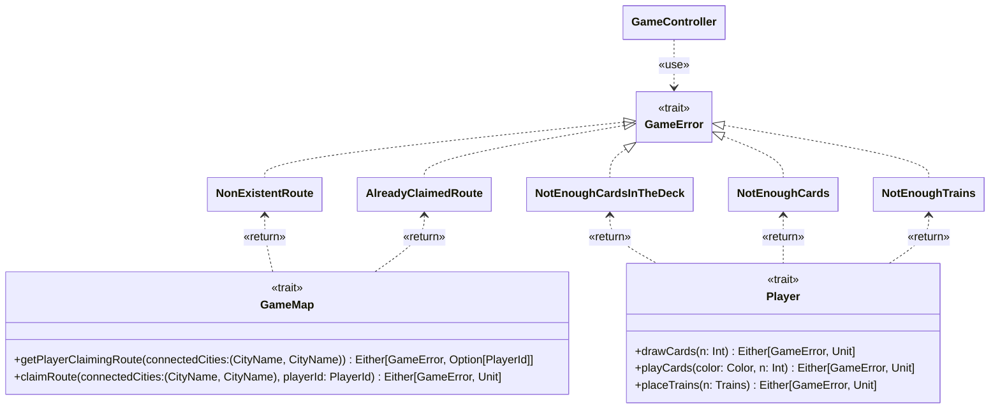

---

title: Gestione degli errori
nav_order: 3
parent: Design Bedeschi Federica

---

# Design di dettaglio - Gestione degli errori

## GameError

`GameError` è un trait che rappresenta un generico errore che può accadere nel corso del gioco. Questo genere di errore
può essere recuperabile all'interno del gioco gestendolo in maniera appropriata.

## Errori del gioco

`NonExistentRoute`, `AlreadyClaimedRoute`, `NotEnoughCardsInTheDeck`, `NotEnoughCards` e `NotEnoughTrains` sono gli
errori che possono accadere all'interno del gioco. I primi due riguardano la `GameMap` e si verificano rispettvamente
quando, una `Route` non esiste, o una `Route` è già occupata. Gli altri tre riguardano il `Player` e si verificano
rispettivamente quando, non sono presenti abbastanza carte da pescare all'interno del mazzo, il giocatore non
possiede abbastanza carte da giocare nella propria mano, o il giocatore non possiede abbastanza treni da piazzare per
occupare una `Route`.

## Gestione degli errori

Gli errori sopracitati vengono restituiti dai metodi di `GameMap` e di `Player` attraverso l'uso di `Either`. In questo
modo i metodi presentano in maniera chiara la possibilità del verificarsi di tali errori, cosicchè possano venire
gestiti nella maniera più appropriata.

## Recupero degli errori in GameController

Il `GameController`, inteso come entità generale, ha quindi la possibilità di intercettare gli errori tramite semplici
**match case**. Nel nostro caso, gli errori che si possono recuperare devono essere presentati all'utente, in modo che
possa cambiare il proprio comportamento. Ad esempio, se un giocatore seleziona una `Route` già occupata da un altro
giocatore, gli deve essere mostrato un messaggio, cosicchè possa selezionare un'altra `Route`.

Inoltre, l'utilizzo di `Either` si integra bene con il costrutto **for-yield**, permettendo di migliorare la leggibilità
del codice nell'effettuare i controlli preliminari necessari prima di eseguire il claim di una `Route`, come visibile
nell'implementazione del `ClaimRouteController` (maggiori dettagli sono forniti
nell'[apposita sezione](../../impl/bedeschi/impl_controller.md)).