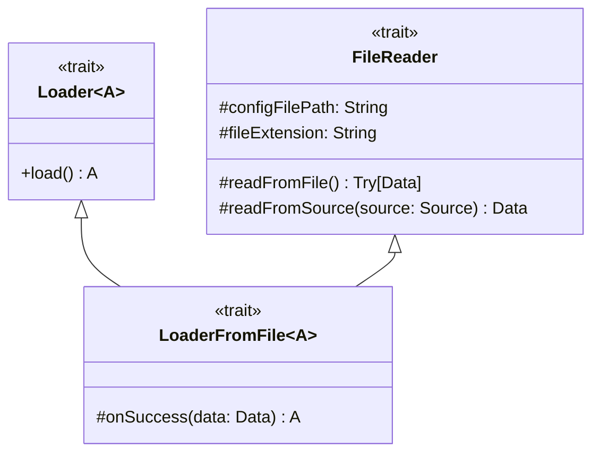

---

title: Loader
nav_order: 2
parent: Design Bedeschi Federica

---

# Design di dettaglio - Loader

## Loader

`Loader` è un trait che descrive un generico caricatore di dati. Possiede un unico metodo per effettuare il caricamento,
il quale ha come tipo di ritorno il **type parameter** `A`, rappresentante il tipo di dato caricato.

## FileReader

`FileReader` è un trait che descrive un lettore di file. Possiede solo metodi protetti, usati per leggere dati da file,
ed è pensato per essere un trait di supporto da utilizzare in maniera nascosta, per non esporre dettagli implementativi
collegati alla lettura da file. E' una **rich interface** contenente tre **abstract methods** e un **template method**.
Il **template method** è `readFromFile`, è quindi già implementato, e contiene la logica per leggere il file formato da
`configFilePath` con estensione `fileExtension` utilizzando la specifica logica di lettura contenuta nel metodo
`readFromSource`. Questi ultimi tre sono gli **abstract methods** e devono quindi essere implementati da chi estende,
che effettuerà le opportune scelte, specificando in particolare la specifica logica di lettura da file.

Nei tipi di ritorno dei metodi `readFromFile` e `readFromSource` si può notare la presenza del tipo `Data`. Questo tipo
è un `protected type Data` che deve essere definito da chi implementerà il trait. `Data` permette quindi di astrarre
ulteriormente il `FileReader`, non vincolando la tipologia di dati letti da file, ma lasciando questa scelta alle
implementazioni.

Il metodo `readFromFile`, inoltre, ha come tipo di ritorno `Try[Data]`, volendo rappresentare la possibilità di
fallimento nel leggere il file.

## LoaderFromFile

`LoaderFromFile` è un trait che descrive un caricatore di dati letti da file. Estende `Loader` e `FileReader` ed
introduce il metodo protetto `onSuccess`. E' una **rich interface** in quanto implementa il metodo `load` di
`Loader`, che diventa **template method**, il quale utilizza l'**abstract method** `onSuccess`. Il metodo `load`
implementato si occupa di leggere i dati da file, utilizzando il metodo `readFromFile` di `FileReader`, e, in caso di
successo, esegue le azioni specificate dal metodo `onSuccess`. Quest'ultimo specifica quindi le azioni da eseguire in
seguito alla lettura da file, a partire dai dati di tipo `Data`, per ottenere i dati di tipo `A`, che saranno quindi
quelli restituiti dal metodo `load`.

Il tipo `Data` non viene ancora definito, per cui `LoaderFromFile` rimane generico, oltre che per il tipo di dati
restituiti `A`, anche per quanto riguarda il tipo di dati (`Data`) letti da file.