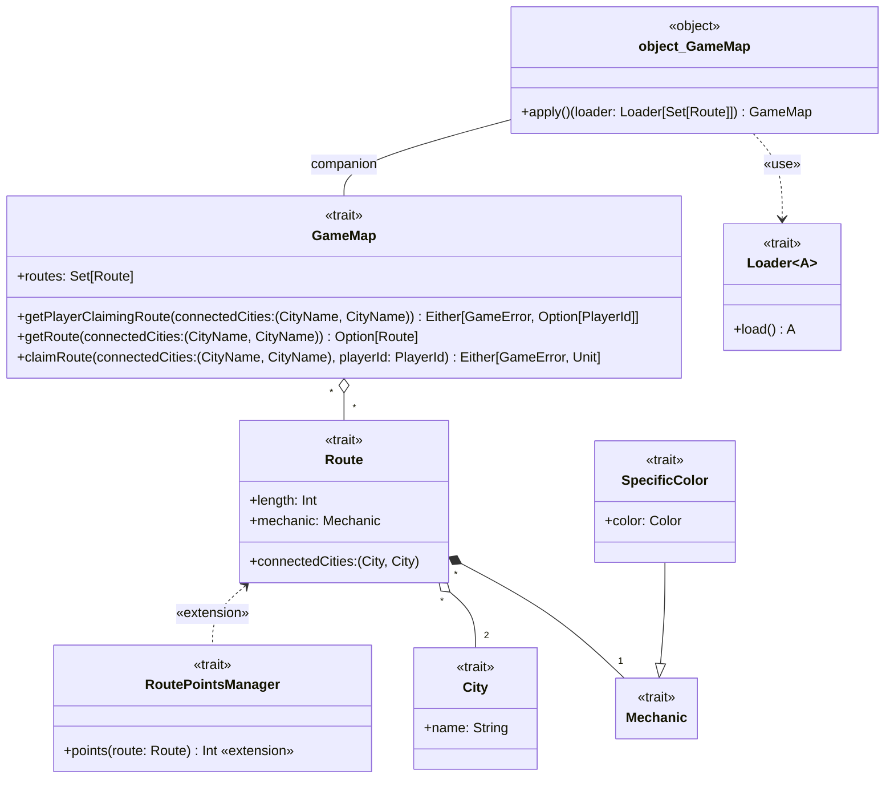

---

title: Map
nav_order: 1
parent: Design Bedeschi Federica

---

# Design di dettaglio - Mappa di gioco

## City

`City` è un trait che descrive una città, caratterizzata da un nome. Il concetto di `City` è stato modellato come trait
per sottolinearne l'importanza che ricopre nel dominio e per dare la possibilità di fornire diverse implementazioni
laddove necessario, lasciando anche la possibilità di estendere il concetto, aggiungendo caratteristiche e/o
comportamenti.

## Route, Mechanic e SpecificColor

`Route` è un trait che descrive una tratta ferroviaria. Non fornendo metodi per modificarne lo stato, è pensato per
modellare una `Route` **immutabile**. Una `Route` è identificabile tramite la coppia di `City` che collega (in cui
l'ordine non è rilevante), e possiede due caratteristiche: la lunghezza della tratta e la meccanica che segue (come da
[requisito utente 1](../../requirement_specification.md#requisiti-utente)).

La meccanica è modellata tramite il trait `Mechanic`, che può essere esteso per creare un insieme di meccaniche
differenti. `SpecificColor` ne è un esempio: estende `Mechanic` e definisce la meccanica per cui una `Route` è di un
certo colore. Ulteriori meccaniche sono possibili, e modellate in questo modo permettono anche di essere composte le une
con le altre (ad esempio si può utilizzare `SpecificColor` come **mixin** per creare una meccanica più complessa che
presenta anche il fatto per cui una `Route` è di un certo colore).

## GameMap e uso di Loader

`GameMap` è un trait che descrive la mappa di gioco, composta da un insieme di `Route` (come da
[requisito utente 1](../../requirement_specification.md#requisiti-utente)). La `GameMap` permette di: ottenere l'insieme
delle `Route` di cui è composta, ottenere una determinata `Route`, occupare una determinata `Route` o sapere quale
player la occupa (come da [requisiti utente 1 e 2](../../requirement_specification.md#requisiti-utente)). In particolare
i metodi `getPlayerClaimingRoute` e `claimRoute` hanno come tipo di ritorno un `Either`, volendo indicare
l'impossibilità di effettuare l'azione richiesta. Il metodo `getPlayerClaimingRoute` può infatti fallire se riceve una
coppia di città che non corrisponde a una `Route` esistente, mentre il metodo `claimRoute` può fallire per lo stesso
motivo ma anche nel caso in cui una `Route` sia già occupata (perciò non occupabile nuovamente). Questi due casi
distinti vanno gestiti tramite due errori differenti. Questi errori, inoltre, potrebbero essere recuperabili nella
gestione del gioco, e gestiti di conseguenza, come meglio spiegato nell'[apposita sezione](./design_errors.md).

Il **companion object** di `GameMap` deve permettere la creazione della mappa utilizzando un `Loader` di `Set[Route]`,
il cui scopo è quello di caricare l'insieme delle `Route` di cui si comporrà la mappa (maggiori dettagli sui `Loader`
sono forniti nelle relative sezioni di [design](./design_loader.md). e
[implementazione](../../impl/bedeschi/impl_loader.md)). La scelta di avere come parametro dell'`apply` un `Loader` si
deve al fatto che si intendono collegare i due concetti, lasciando però all'utilizzatore la scelta di quale
implementazione di `Loader` utilizzare. Il parametro `loader` è un **context parameter**, pensato per semplificare la
creazione di mappe utilizzando il medesimo `Loader`, fornito come **given instance**. Nel **companion object** è
presente la **given instance** di default.

La `GameMap` risulta immutabile per quanto rigurda l'insieme delle `Route` e mutabile nell'assegnazione dei player alle
`Route`. Considerando i metodi che restituiscono l'insieme delle `Route` e una singola `Route`, si denota l'importanza
di avere modellato la `Route` come immutabile, cosicchè nessuno possa modificare impropriamente la/e `Route` ottenuta/e.

## RoutePointsManager

`RoutePointsManager` è un trait che rappresenta un gestore di punteggi da assegnare ai giocatori quando occupano una
`Route`. Presenta un singolo metodo, che è un **extension method** su `Route`, per ottenerne il relativo punteggio.
Diverse strategie possono essere adottate, ad esempio basandosi sulla lunghezza della `Route`, sul colore, sulle città
collegate, su combinazioni di queste o tenendo in considerazione ulteriori fattori.

Il concetto dell'assegnamento dei punteggi alle `Route` è stato modellato in questo modo e non (ad esempio) come
decorazione di `Route` perchè si vede il punteggio come un concetto non intrinseco alla `Route`, possibilmente
derivante da più fattori (anche esterni alla `Route`) ed eventulamente anche dinamico, che si ritiene esuli dal concetto
di `Route`, la quale perderebbe inoltre il vantaggio dell'immutabilità.