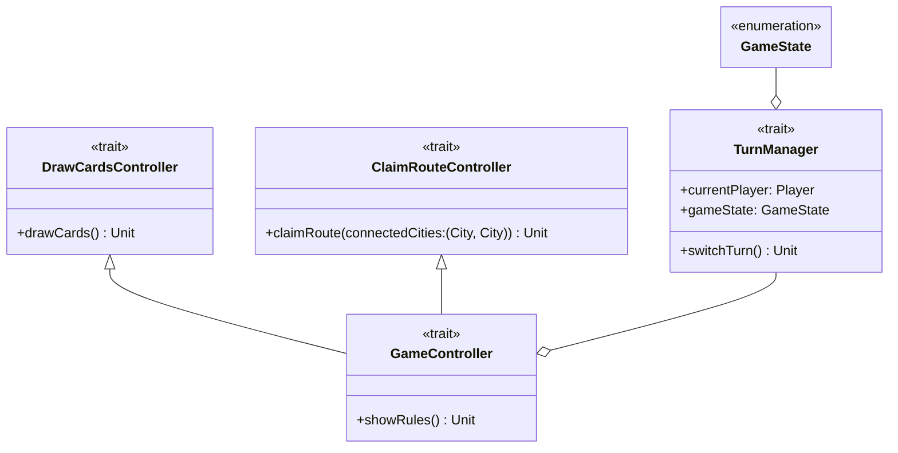

---

title: Controller
nav_order: 1
parent: Design di dettaglio

---

# Design Controller

## GameController

Il trait `GameController` rappresenta il *controller* del gioco ed è quindi l'entità centrale con cui tutti comunicano.
Estende `DrawCardsController` e `ClaimRouteController` per includere le azioni di pescaggio ed occupazione di una
tratta. Inoltre contiene un `TurnManager`, il quale mantiene lo stato della partita tramite un `GameState` che viene
rappresentato tramite un'enumerazione dei possibili stati. Espone quindi il `GameState` corrente, oltre al giocatore di
turno e al metodo `switchTurn` che si occupa di cambiare il turno (come da
[requisito di sistema 2](../requirement_specification.md#requisiti-di-sistema)).