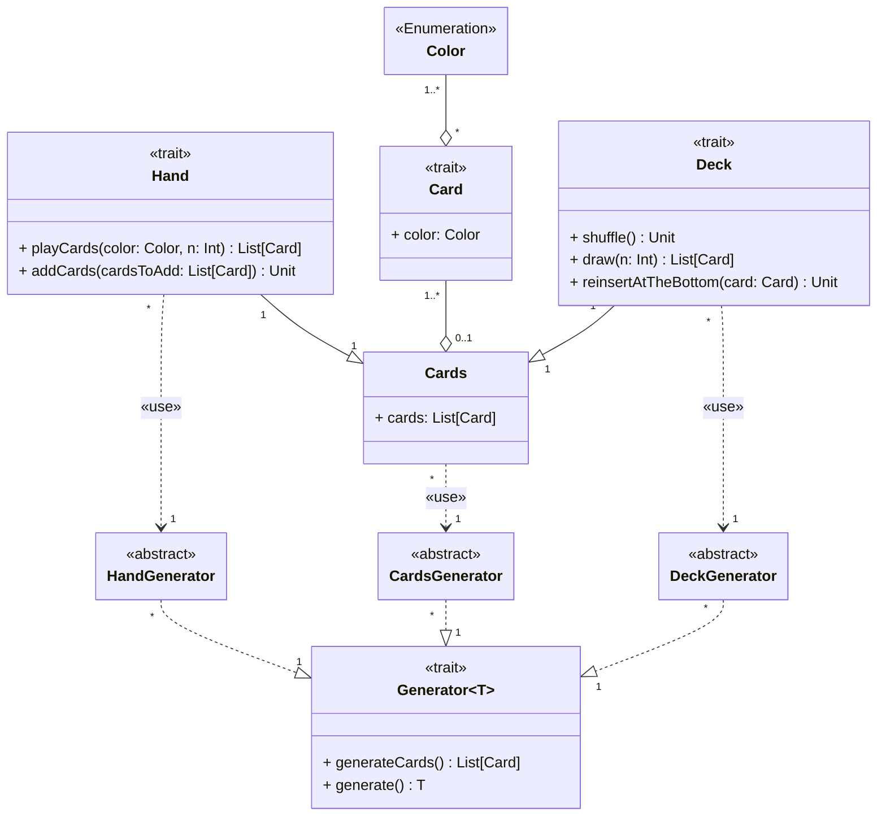

---

title: Cards
nav_order: 1
parent: Design Pracucci Filippo

---

# Design carte

## Color

Consiste in un'enumerazione dei possibili colori delle carte vagone.

## Card

L'entità `Card`, intesa come carta vagone, è caratterizzata da un colore. Dato che le entità che ne necessitano, ovvero
`Deck` e `Hand`, le utilizzano sotto forma di lista, si crea un'entità `Cards`. Dunque sia `Deck` che `Hand` sono delle
estensioni di `Cards`.

## Generator

Si tratta di un generatore generico per Cards e chiunque aderisca al suo contratto. Le generazioni consentite sono:
- `generate()`: per generare un'istanza del tipo passato come _type parameter_;
- `generateCards()`: per generare una lista di carte.

La genericità consente di realizzare un'implementazione per `Cards`, una per il `Deck` ed una per l'`Hand` del
giocatore.

## Deck

Il concetto di `Deck` rappresenta il mazzo di carte vagone, con il quale è possibile effettuare tre azioni:
- `shuffle`: mischiare le carte;
- `draw`: pescare un qualsiasi numero positivo di carte;
- `reinsertAtTheBottom`: reinserire una carta in fondo.

Il mazzo di carte viene creato sfruttando un'istanza del `DeckGenerator`, ovvero l'implementazione di `Generator` per il
`Deck`.

## Hand

Il concetto di `Hand` rappresenta la mano del giocatore, la quale è composta da un insieme di carte vagone. Le azioni
che la riguardano consistono in:
- `playCards`: giocare una lista di carte presenti nella mano specificando il numero di carte di un determinato colore.
  Questo metodo viene utilizzato per occupare una tratta sulla mappa di gioco;
- `addCards`: aggiungere una lista di carte. Questo metodo viene usato per aggiungere alla mano del giocatore la lista
  di carte pescato dal mazzo.

La mano del giocatore viene creata sfruttando un'istanza del `HandGenerator`, ovvero l'implementazione di `Generator`
per `Hand`.
