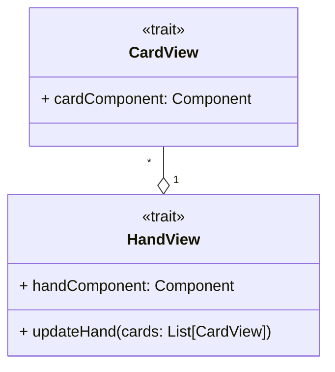

---

title: Cards View
nav_order: 3
parent: Design Pracucci Filippo

---

# Design view delle carte

## CardView

L'entità `CardView`, intesa come rappresentazione di una carta vagone, è realizzata tramite un componente di
`scala.swing`.

## HandView

Il concetto di `HandView` identifica la rappresentazione della mano del giocatore, la quale è composta da un insieme di
`CardView`. La rappresentazione consiste in un componente di `scala.swing` ed inoltre mette a disposizione la
possibilità di aggiornamento, passando la nuova lista di `CardView` che rappresentano la mano.
