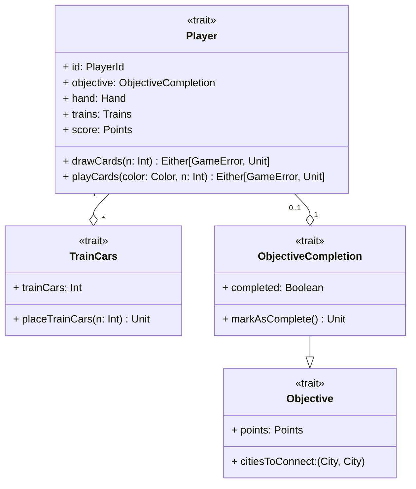

---

title: Design Player
nav_order: 2
parent: Pracucci Design

---

# Design giocatore

## TrainCars

Consiste nella rappresentazione dei vagoni che sono posseduti dal giocatore. L'unica azione che si può effettuare su di
essi è `placeTrainCars`, cioè piazzarne una determinata quantità sulla mappa di gioco; questo viene fatto nel caso in
cui il giocatore riesca ad occupare con successo una tratta.

## Player

L'entità `Player` rappresenta il giocatore, la quale viene identificata tramite un `PlayerId` e si compone di altre
entità esterne come un obiettivo da raggiungere, un insieme di vagoni da utilizzare per occupare delle tratte sulla
mappa, una `Hand` composta da carte vagone, pescate dal mazzo e giocate per occupare le tratte e uno score che
corrisponde alla quantità dei punti (`Points`) accumulati dal giocatore fino a quel momento. Il giocatore può effettuare
due azioni principali:
- `drawCards`: pescare delle carte dal mazzo per aggiungerle alla propria mano;
- `playCards`: giocare un numero di carte dalla propria mano di un determinato colore.

## Objective

Il trait `Objective` rappresenta l'obiettivo assegnato al giocatore, il quale deve cercare di portarlo a termine; esso è
caratterizzato da una coppia di città da connettere ed un numero di punti che gli vengono assegnati se completato.
Si estende la forma base di obiettivo con il concetto di completamento, realizzando il trait `ObjectiveCompletion`, che
aggiunge la possibilità di osservare il suo stato di completamento e di segnarlo come completato tramite il metodo
`markAsComplete()`. Quello che si vuole rendere possibile con il trait `Objective` è la sua decorazione con funzionalità
e caratteristiche aggiuntive, come è stato fatto con `ObjectiveCompletion`, che si potrebbero voler aggiungere in
futuro.

