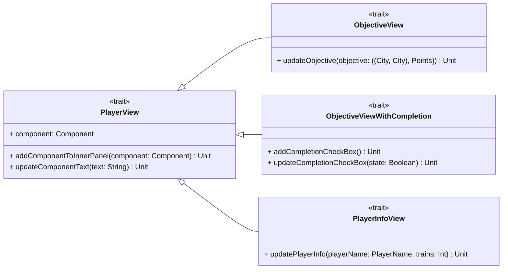

---

title: Player View
nav_order: 4
parent: Design Pracucci Filippo

---

# Design view giocatori

## PlayerView

L'entità `PlayerView`, intesa come rappresentazione di un giocatore, è realizzata tramite un componente di
`scala.swing`. Inoltre è possibile:
- `addComponentToInnerPanel(component: Component)`: aggiungere un ulteriore componente al pannello interno della _view_;
- `updateComponentText(text: String)`: aggiornare il testo del componente.

Questo trait ha lo scopo di racchiudere tutti gli aspetti rappresentativi comuni delle singole caratteristiche
dei giocatori.
Ogni estensione del trait, come `ObjectiveView`, `ObjectiveViewWithCompletion` e `PlayerInfoView`, viene gestita come
una decorazione di un'implementazione di base della rappresentazione del giocatore; in questo modo in futuro sarà
semplice modificare una funzionalità o aggiungere varie caratteristiche alla _view_.

## ObjectiveView

Il concetto di `ObjectiveView` identifica la rappresentazione dell'obiettivo del giocatore, il quale è composto da una
coppia di città da collegare e un valore in punti. `ObjectiveView` estende `PlayerView`, aggiungendo la possibilità di
aggiornare l'obiettivo che si mostra, passando il nuovo obiettivo; in questo modo tramite un'unica istanza è possibile
mostrare l'obiettivo di ogni giocatore, aggiornando ad ogni turno l'obiettivo con `updateObjective`.

## ObjectiveViewWithCompletion

`ObjectiveViewWithCompletion` estende `PlayerView` e consiste nella rappresentazione dello stato di completamento
dell'obiettivo, tramite una checkbox, la quale può essere aggiornata tramite `updateCompletionCheckBox`.

## PlayerInfoView

Il concetto di `PlayerInfoView` identifica la rappresentazione delle informazioni riguardanti il giocatore, ovvero il
nome e il numero di vagoni rimasti. `PlayerInfoView` estende `PlayerView`, aggiungendo la possibilità di aggiornare le
informazioni che si mostrano, passando le nuove informazioni; in questo modo tramite un'unica istanza è possibile
mostrare le informazioni di ogni giocatore, aggiornando ad ogni turno le informazioni con `updatePlayerInfo`.
