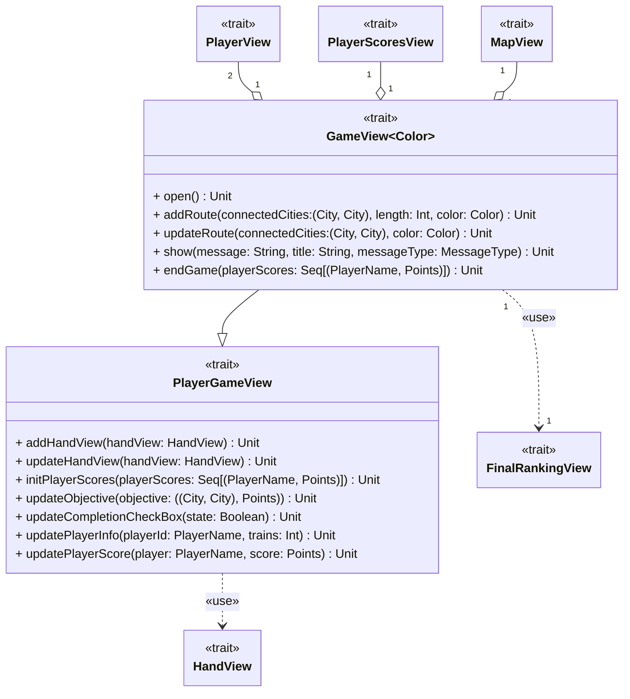

---

title: View
nav_order: 1
parent: Design di dettaglio

---

# Design View

## GameView

Il trait `GameView` è generico nel parametro `Color` in modo da non essere vincolati dalla scelta implementativa.
Estende il trait `PlayerGameView` per esporre anche i metodi relativi alle informazioni dei giocatori (obiettivo, numero
di treni rimasti, punteggi...), in questo modo il _controller_ può interagire esclusivamente con `GameView`. La _view_
si compone di:
- `PlayerInfoView`: è un'estensione di `PlayerView`, che viene utilizzato per mostrare il nome ed il numero di treni
rimasti del giocatore di turno.
- `ObjectiveView`: è un'estensione di `PlayerView`, che viene utilizzato per mostrare l'obiettivo del giocatore di
turno.
- `PlayerScoresView`: viene utilizzato per mostrare il punteggio di tutti i giocatori durante la partita.
- `MapView`: viene utilizzato per mostrare la mappa di gioco. 

Inoltre sono presenti i pulsanti per permettere al giocatore di turno di pescare dal mazzo e per visualizzare le regole.
Infine `GameView` sfrutta `HandView` per mostrare la mano del giocatore di turno e `FinalRankingView` per visualizzare
la classifica finale al termine della partita.

`GameView` espone metodi per:
- `open`: visualizzare la _view_;
- `addRoute`: aggiungere una route alla `MapView`. Viene utilizzato solo durante la creazione della mappa, prima
dell'inizio della partita;
- `updateRoute`: aggiornare una route, segnalandola come occupata dal giocatore di turno;
- `show`: mostrare qualunque tipo di messaggio che si vuole far visualizzare al giocatore, inclusi gli errori che si
riscontrano durante la partita;
- `endGame`: segnalare il termine della partita e visualizzare la classifica finale.

All'interno di `GameView` vengono utilizzati tre **type** `City`, `PlayerName` e `Points` per rappresentare
rispettivamente una città, il nome di un giocatore e i punti. Inoltre i messaggi che si possono mostrare sono
differenziati in base ad un `MessageType`, il quale può essere esteso per aggiungere una nuova tipologia.

## PlayerGameView

Il trait `PlayerGameView` mette a disposizione metodi per:
- `addHandView`: aggiungere l'`HandView` alla _view_;
- `updateHandView`: aggiornare l'`HandView` al termine del turno;
- `initPlayerScores`: inizializzare i punteggi dei giocatori;
- `updateObjective`: aggiornare l'`ObjectiveView` al termine del turno;
- `updateCompletionCheckBox`: aggiornare lo stato di completamento dell'obiettivo;
- `updatePlayerInfo`: aggiornare le informazioni del giocatore al termine del turno;
- `updatePlayerScore`: aggiornare il punteggio del giocatore di turno.
