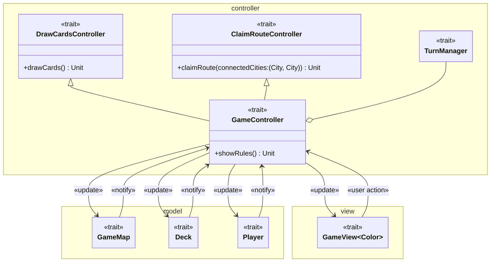

---

title: Design architetturale
nav_order: 3
parent: Report

---

# Design architetturale

## MVC

Abbiamo deciso di utilizzare come pattern architetturale il **pattern MVC** (Model-View-Controller) in quanto il gioco
Ticket to Ride è un gioco a turni e non real-time, e quindi il pattern MVC ci permette una più chiara divisione dei
componenti e delle loro responsabilità.

## Model

I tre componenti principali del *model* sono:
- `GameMap`: rappresenta la mappa di gioco, composta da città collegate tra loro tramite tratte ferroviarie; le tratte
possono essere occupate dai giocatori scartando carte dalla propria mano;
- `Deck`: rappresenta il mazzo delle carte vagone, da cui i giocatori possono pescare per aumentare la propria mano;
- `Player`: rappresenta il giocatore, il quale ad ogni turno può decidere di pescare carte dal mazzo oppure occupare una
tratta ferroviaria piazzando i suoi treni; ogni giocatore ha un carta obiettivo e il suo scopo è quello di completarlo e
di ottenere il maggior numero di punti.

## View

`GameView` rappresenta la *view* del gioco e deve contenere tutte le informazioni necessarie per giocare:
- le informazioni e l'obiettivo del giocatore di turno;
- i punteggi di tutti i giocatori;
- la mano del giocatore di turno;
- la mappa di gioco.

Deve permettere le interazioni per pescare dal mazzo ed occupare una tratta ferroviaria della mappa.

## Controller

`GameController` rappresenta il *controller* del gioco. Estende `DrawCardsController` e `ClaimRouteController`, e
contiene un `TurnManager`. Il suo compito principale è quello di ricevere richieste di modifica da parte della *view* e
di richiedere il conseguente aggiornamento del *model*, notificandolo poi alla *view*.

### DrawCardsController

`DrawCardsController` gestisce l'azione di pescaggio delle carte dal mazzo. Riceve dalla *view* la richiesta di pescare,
in seguito alla quale attiva l'azione di pescaggio del giocatore di turno, infine cambia turno ed aggiorna la *view*.

### ClaimRouteController

`ClaimRouteController` gestisce l'azione di occupazione di una tratta ferroviaria della mappa. Riceve dalla *view* la
richiesta di occupare una tratta, in seguito alla quale attiva l'azione di occupazione della tratta da parte del
giocatore di turno, infine cambia turno ed aggiorna la *view*.

### TurnManager

`TurnManager` gestisce lo stato della partita occupandosi del cambio di turno dei giocatori, tenendo traccia del
giocatore di turno. Inoltre ha il compito di determinare l'inizio dell'ultimo round di gioco e la conseguente fine della
partita.