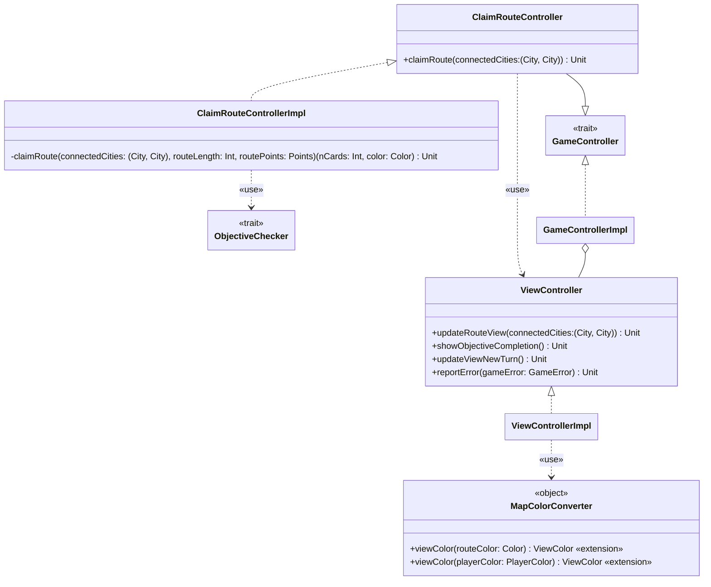

---

title: ClaimRouteController
nav_order: 5
parent: Implementazione

---

# Implementazione - ClaimRouteController

## ClaimRouteController e ClaimRouteControllerImpl

`ClaimRouteController` è un trait che rappresenta un controller di gioco responsabile dell'azione di occupazione di una
tratta ferroviaria. `ClaimRouteControllerImpl` è la sua implementazione di base contenuta nel companion object.
Quest'ultima utilizza un oggetto `ImportHelper` all'interno del quale vengono fatti gli **export** di ciò che deve
essere importato in `ClaimRouteControllerImpl`. Implementa il metodo `claimRoute`, il quale riceve in input la coppia di
città rappresentante la tratta da occupare, e si occupa quindi di effettuare le azioni necessarie all'occupazione della
medesima da parte del giocatore di turno. Per fare ciò, recupera la `Route` dalla `GameMap` ed in base alla meccanica
della route esegue le azioni necessarie; a tale scopo utilizza l'oggetto privato `ClaimRouteHelper`.

`ClaimRouteHelper` contiene come metodo principale `claimRoute`, inteso come metodo generico, prendendo in input la
coppia di città, la lunghezza della route, i punti di essa ed infine la quantità e il colore della carte da giocare.
Particolare attenzione va data agli errori che le operazioni per occupare una tratta possono generare, e al non creare
uno stato di gioco incoerente (ad esempio l'aggiornamento della mappa potrebbe andare a buon fine perchè la tratta è
libera, ma il giocatore potrebbe non avere abbastanza carte, o non avere abbastanza treni da piazzare, ecc). Per questo 
motivo viene utilizzato un **for-yield** per effettuare prima tutti i controlli (come da
[requisito utente 4](../../requirement_specification.md#requisiti-utente)) e solo dopo eseguire effettivamente le
operazioni, al termine delle quali viene controllato il completamento dell'obiettivo (tramite un'istanza di
`ObjectiveChecker`), viene aggiornato il punteggio del giocatore (come da
[requisito di sistema 3](../../requirement_specification.md#requisiti-di-sistema)) e viene infine cambiato il turno ed
aggiornata la *view*. Per rendere possibile un **for-yield** di questo tipo si sfrutta il tipo `Either` con tipo
d'errore `GameError`, che, combinato col **for-yield**, permette di gestire una sequenza di azioni (che possono fallire
con un errore sottotipo di `GameError`) in maniera chiara, portando ad una maggiore leggibilità del codice. Infine, in
caso di fallimento, l'errore generato viene mostrato al giocatore tramite il `ViewController` che aggiorna la
`GameView`.

## MapColorConverter

`MapColorConverter` è un oggetto che contiene metodi per effettuare le conversioni tra *model* e *view* per quanto
riguarda i colori che dovranno essere usati all'interno della view della mappa. Fornisce quindi due **extension
methods** per trasformare rispettivamente `Color` e `PlayerColor` in `java.awt.Color`.