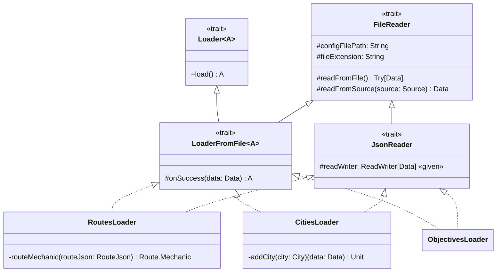

---

title: LoaderImpl
nav_order: 2
parent: Implementazione Bedeschi Federica

---

# Implementazione - Loader

## Scelta dei file JSON per i file di configurazione del gioco

Per il gioco Ticket to Ride si è scelto di utilizzare tre file di configurazione, per caricare le informazioni
rigurdanti le tratte ferroviarie, le città, e gli obiettivi. Si è scelto di utilizzare file JSON, considerando che
JSON è uno standard molto diffuso, facilmente leggibile sia dalle persone che dai computer, e con una struttura
semplice, di cui si fa parsing velocemente utilizzando librerie che sono ormai stabili. In particolare, il fatto che sia
facilmente leggibile dalle persone rende più facile mantenere i file di configurazione, che nel nostro caso contengono
principlamente informazioni da mostrare all'utente.

I file di configurazione utilizzati sono contenuti in "src/main/resources/" e posseggono le seguenti strutture:
- "objectives.json": contiene una lista di obiettivi, ognuno composto dalla coppia di città da collegare e dal
punteggio da assegnare al giocatore quando viene completato; contiene pertanto informazioni rigurdanti il *model*;
- "routes.json": contiene una lista di tratte ferroviarie, ognuna composta dalla coppia di città che collega, dalla
sua lunghezza e della meccanica che segue (a sua volta composta dal tipo e dal valore); anch'esso contiene pertanto
informazioni riguardanti il *model*;
- "cities.json": contiene due valori `scaleWidth` e `scaleHeight` che rappresentano i massimi valori di larghezza /
altezza utilizzati come scala, seguiti dalla lista di città, ognuna composta dal nome e dalle coordinate x e y; questo
file è l'unico che serve alla *view*, la quale necessita di sapere come posizionare le città nella mappa grafica.

## JsonReader

`JsonReader` è un trait che descrive un lettore di file JSON. Estende `FileReader` e reifica la scelta implementativa di
utilizzare file JSON tramite la liberia **uPickle**. La scelta di questa libreria si deve al fatto che essa è molto
leggera e semplice da usare, ed inoltre supporta in maniera diretta la lettura in `case class`; di conseguenza ha le
caratteristiche conformi all'uso semplice e marginale richiesto nel nostro caso.

`JsonReader` implementa quindi il metodo `fileExtension`, specificando l'estensione `json`, ed il metodo
`readFromSource`, definendo la strategia di lettura utilizzando i metodi forniti dalla libreria uPickle. Non definisce
il tipo `Data`, rimanendo pertanto generico per quanto riguarda il tipo di dati letti da file. Introduce quindi un
`protected given readWriter` di tipo `ReadWriter[Data]`, con `ReadWriter` proveniente dalla libreria uPickle, il quale
rappresenta un lettore e scrittore, utilizzato in questo caso per valori di tipo `Data`. La **given instance** deve
essere fornita dall'implementazione che definisce anche il tipo `Data`, dovendo questa fornire il modo in cui leggere
`Data`.

`JsonReader` risulta quindi utilizzabile come **mixin**, e viene infatti utilizzato per creare le classi
`ObjectivesLoader`, `RoutesLoader` e `CitiesLoader`.

## ObjectivesLoader, RoutesLoader e CitiesLoader

`ObjectivesLoader`, `RoutesLoader` e `CitiesLoader` sono le tre classi che si occupano di leggere e caricare le
informazioni contenute nei tre file di configurazione "objectives.json", "routes.json" e "cities.json", rispettivamente.
Ognuna estende `LoaderFromFile` e `JsonReader`, variando il tipo parametrico di `LoaderFromFile` a seconda del tipo dei
dati caricati. Tutte e tre le classi presentano tra i parametri del costruttore `overload val configFilePath`,
assegnandogli un valore di default corrispondente ai file sopraindicati. Viene quindi fatto un binding tra l'istanza
di una classe e il file da leggere, scelta che mira a rendere più semplice e chiaro l'utilizzo di tali istanze.

### ObjectivesLoader

`ObjectivesLoader` estende, oltre a `JsonReader`, `LoaderFromFile[Set[ObjectiveWithCompletion]]`, definendo quindi come
tipo di dati caricati un insieme di obiettivi. Al suo interno definisce due `case class` protette, `CityJson` e
`ObjectiveJson`, utilizzate per rappresentare le corrispondenti strutture JSON. Definisce poi `Data` come
`Set[ObjectiveJson]` e ne fornisce la **given instance** per il suo `ReadWriter`, aggiungendo anche quelle necessarie
per i tipi `CityJson` e `ObjectiveJson`. Infine, implementa il metodo `onSuccess` specificando il mapping da effettuare
per trasformare `Data`, ovvero `Set[ObjectiveJson]`, in `Set[ObjectiveWithCompletion]`.

### RoutesLoader

`RoutesLoader` estende, oltre a `JsonReader`, `LoaderFromFile[Set[Route]]`, definendo quindi come tipo di dati caricati
un insieme di tratte ferroviarie. Al suo interno definisce tre `case class` protette, `CityJson`, `RouteJson` e
`MechanicJson`, utilizzate per rappresentare le corrispondenti strutture JSON. Definisce poi `Data` come
`Set[RouteJson]` e ne fornisce la **given instance** per il suo `ReadWriter`, aggiungendo anche quelle necessarie
per i tipi `CityJson`, `RouteJson` e `MechanicJson`. Infine, implementa il metodo `onSuccess` specificando il mapping da
effettuare per trasformare `Data`, ovvero `Set[RouteJson]`, in `Set[Route]`. Per effetuare il mapping si avvale di un
oggetto privato che contiene due **extension methods** utili per convertire la meccanica da `MechanicJson` alla
specifica meccanica di tipo `Mechanic`.

### CitiesLoader

`CitiesLoader` estende, oltre a `JsonReader`, `LoaderFromFile[Unit]`, definendo il caso particolare in cui il loader
esegue delle azioni che causano un side effect. Al suo interno definisce due `case class` protette, `City` e
`ConfigData`, utilizzate per rappresentare le corrispondenti strutture JSON, overro `City` composta da un nome e dalle
coordinate x e y, e `ConfigData`, che rappresenta l'intero file, ed è composta da `scaleWidth`, `scaleHeight` (coi
significati spiegati precedentemente) e`cities` (`Set[City]`). Definisce poi `Data` come `ConfigData` e ne fornisce la
**given instance** per il suo `ReadWriter`, aggiungendo anche quella necessaria per il tipo `City` definito. Infine,
implementa il metodo `onSuccess` definendo il side effect da ottenere, ovvero aggiungere ogni città (contenuta in
`cities` all'interno di `ConfigData`), nella view della mappa. Per ottenere ciò, il costruttore di `CitiesLoader`
presenta, oltre a `configFilePath`, altri tre parametri: `mapWidth` e `mapHeight`, che rappresentano la larghezza e
l'altezza in pixel della view della mappa, e `mapView` come **context parameter**, che rappresenta la view della mappa,
in cui devono essere aggiunte le città. Il metodo `onSuccess`, quindi, si avvale dell'uso del metodo privato `addCity`,
che si occupa di scalare le coordinate x e y delle città in base a `scaleWidth`/`scaleHeight` e `mapWidth`/`mapHeight`
ed aggiungere le città così aggiornate all'interno di `mapView`.

### Conclusione

`ObjectivesLoader`, `RoutesLoader` e `CitiesLoader` incapsulano e nascondono quindi ogni dettaglio riguardante la
lettura da file, lasciando esposto il solo metodo `load` che restituisce tipi di dati non dipendenti da rappresentazioni
collegate ai file JSON.