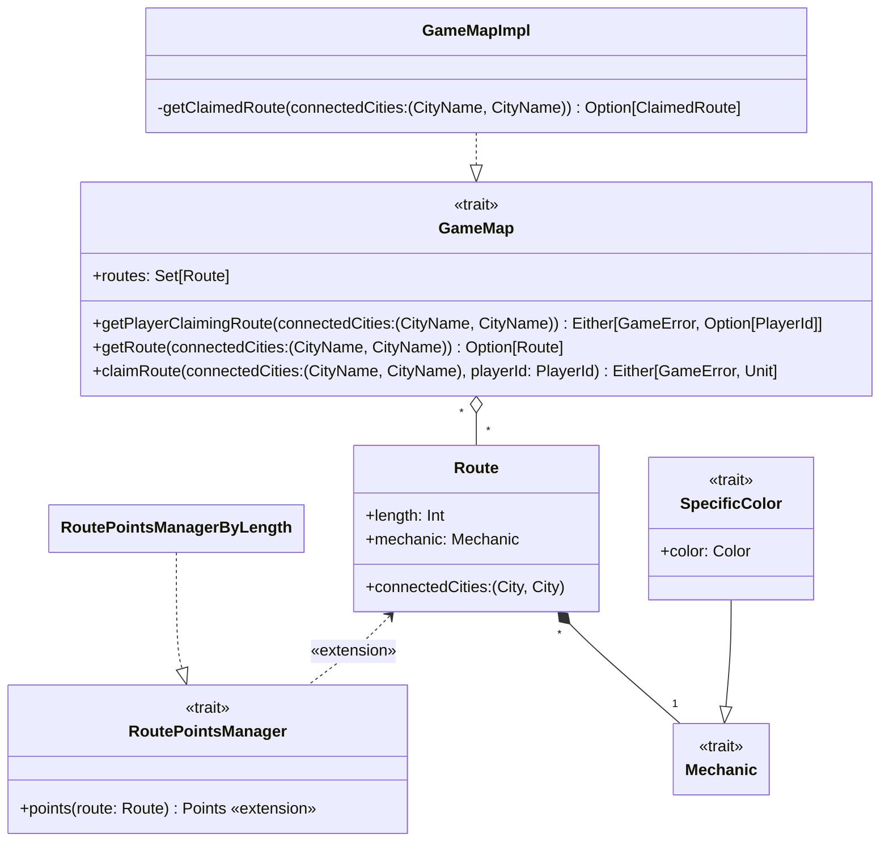

---

title: Map
nav_order: 1
parent: Implementazione Bedeschi Federica

---

# Implementazione - Mappa di gioco

## SpecificColor

Nel companion object è presente un metodo **unapply** incaricato di estrarre da un'istanza di `SpecificColor` il colore,
facilitandone il pattern matching.

## GameMap e GameMapImpl

In `GameMap` viene utilizzato un **type** `CityName` alias di `String` per migliorare la chiarezza e la leggibilità del
codice.

Nel companion object viene fornita la **given instance** di default di `Loader[Set[Route]]` corrispondente a
`RoutesLoader()`, la quale è un'implementazione di `Loader` che carica l'insieme delle `Route` da file JSON (maggiori
dettagli sul `RoutesLoader` sono presenti nell'[apposita sezione](./impl_loader.md#routesloader)).

All'interno dell'implementazione `GameMapImpl` viene utilizzato un **type** `ClaimedRoute` alias di
`(Route, Option[PlayerId])` per migliorare la chiarezza e la leggibilità del codice, considerando la complessità di un
tipo così composto. `ClaimedRoute` rappresenta quindi una route che può essere occupata da un player. Se
`Option[PlayerId]` è `None` vuol dire che la `Route` non è ancora stata occupata. Si utilizza quindi una
`var claimedRoutes`, contenente le `ClaimedRoute`, per rappresentare la mappa. Il metodo privato `getClaimedRoute` si
occupa di ottenere una determinata `ClaimedRoute` da `claimedRoutes`, e serve da base per gli altri tre metodi. Questo
metodo implementa il concetto per cui una `Route` è identificabile da una coppia di città, indicate in qualunque ordine.

## RoutePointsManagerByLength

L'implementazione di `RoutePointsManager`, `RoutePointsManagerByLength`, assegna i punteggi alle `Route` in base alla
loro lunghezza. Questa è la scelta base del gioco, e le corrispondenze tra le lunghezze e i punteggi sono pertanto
indicate tra i valori costanti del gioco all'interno di `GameConfig`.