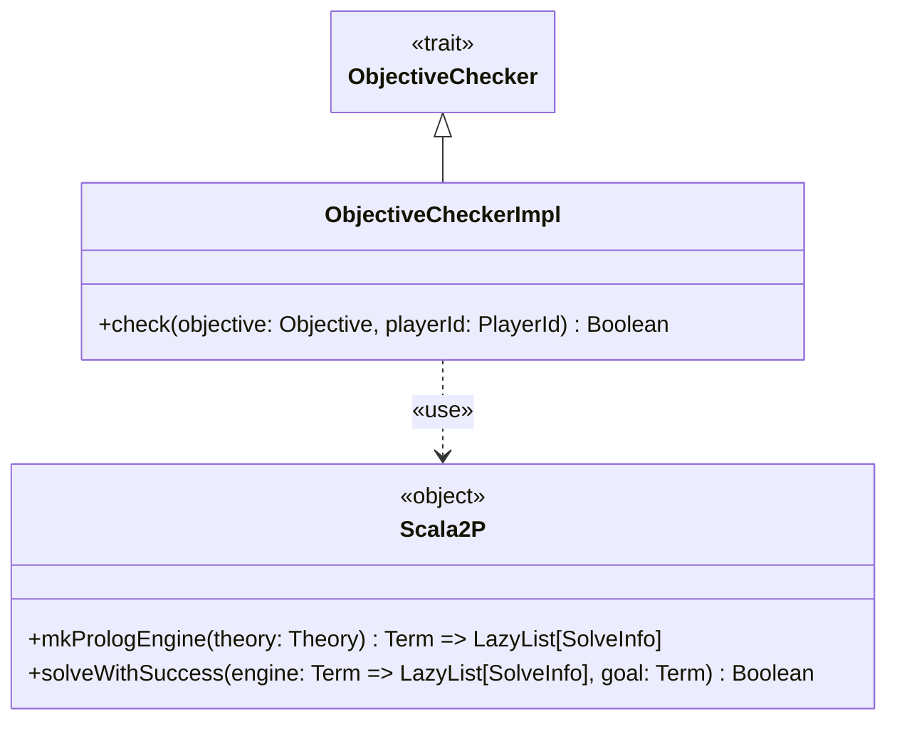

---

title: ObjectiveChecker
nav_order: 4
parent: Implementazione Bedeschi Federica

---

# Implementazione - ObjectiveChecker



## Scelta di Prolog per effettuare il controllo del completamento degli obiettivi

La scelta di Prolog per effettuare il controllo del completamento degli obiettivi deriva dal fatto che il controllo si
basa sulla mappa di gioco, che di fatto è un grafo di città collegate da tratte ferroviarie. A partire da una città
dell'obiettivo è necessario esplorare tutti i cammini percorribili fino all'altra città dell'obiettivo per cercare se
uno di questi è interamente controllato dal giocatore. Questo controllo presenta quindi un chiaro problema di ricerca in
uno spazio di soluzioni e Prolog è un linguaggio particolarmente adatto a risolvere questo tipo di problemi.

## Scala2P

`Scala2P` è un object che contiene metodi utili per lavorare con Prolog in Scala. E' stato adattato dal codice del
[laboratorio 12](https://github.com/unibo-pps/pps-lab12/blob/master/src/main/scala/it/unibo/u12lab/code/Scala2P.scala).
Utilizza la libreria `alice.tuprolog` ed, oltre a contenere delle **implicit conversions**, contiene i metodi
`mkPrologEngine` e `solveWithSuccess`, il primo utilizzato per creare un risolutore Prolog a partire da una teoria, e il
secondo utilizzato per risolvere un goal dato un risolutore Prolog.

## ObjectiveCheckerImpl

`ObjectiveCheckerImpl` è l'implementazione fornita nel companion object di `ObjectiveChecker` per esso. Contiene perciò
il metodo `check`, che, a partire da un `Objective` e da un `PlayerId`, è in grado di determinare se l'obiettivo è
stato completato dal giocatore oppure no. Per effettuare questo controllo, `ObjectiveCheckerImpl` si avvale dell'uso di
`Scala2P` per ottenere il risolutore Prolog fornendogli la teoria adeguata, e per risolvere i goal. Si occupa quindi di
stabilire la teoria Prolog necessaria e il template dei goal, avvalendosi inoltre di un oggetto privato per contenere
gli **extension methods** necessari a convertire elementi di *model* in termini Prolog.

Il metodo `check` costruisce lo specifico goal e lo risolve tramite il metodo `solveWithSuccess` di `Scala2P` con
l'unico obiettivo di verificare se esiste almeno una soluzione: in caso positivo l'obiettivo è stato completato, in caso
negativo no.

### Teoria Prolog e goal

Nella teoria Prolog vengono utilizzati 4 predicati: `any_path` a 5 e 6 termini, `connected` e `not_member`. Il primo
è il predicato specificato nel goal, mentre gli altri vengono utilizzati come supporto. Il template del goal è:
```
any_path($graph, $city1, $city2, $player, _).
```
con `$graph` che è una lista di archi `e($city1, $city2, $player)` (contenente gli atomi rappresentanti le due città
collegate dalla tratta ferroviaria e l'id del player che la occupa o `none` se non è occupata), `$city1` e `$city2` che
sono le città dell'obiettivo, e`$player` che è il possessore dell'obiettivo.

Il predicato `any_path` in questo caso viene quindi utilizzato per cercare la presenza di cammini colleganti le due
città dell'obiettivo le cui tratte siano occupate dal player possessore dell'obiettivo. Punti di attenzione:
- il grafo della mappa è un grafo non orientato, ovvero un arco collegante due nodi rappresenta tale collegamento a
prescindere dall'ordine in cui questi sono indicati; questo problema è risolto dal predicato `connected`, che indica che
due nodi sono collegati se un arco è presente nel grafo con i due nodi indicati in qualunque ordine;
- il grafo della mappa è un grafo ciclico; questo problema è risolto dal predicato `any_path` a 6 termini e dal
predicato `not_member` nel seguente modo: `any_path` utilizza una lista di nodi visitati, e, durante l'esplorazione di
un cammino, non prosegue se incontra un nodo già visitato (ovvero presente nella lista, effettuando il controllo tramite 
il predicato `not_member`), altrimenti aggiunge il nuovo nodo incontrato alla lista dei nodi visitati e continua
l'esplorazione.