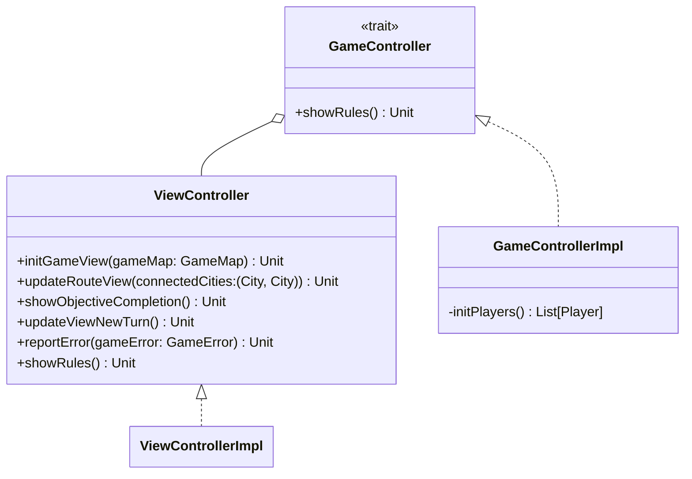

---

title: Controller
nav_order: 1
parent: Implementazione

---

# Implementazione Controller

## GameControllerImpl

`GameControllerImpl` è l'implementazione di `GameController` fornita dal suo **companion object**. E' modellato come
**singleton** in quanto deve essere l'unica istanza di `GameController` con cui tutti comunicano. Utilizza un oggetto
`ImportHelper` all'interno del quale vengono fatti gli **export** di ciò che deve essere importato in
`GameControllerImpl`. All'interno di `GameControllerImpl` vengono create le istanze dei principali componenti del gioco:
- `gameMap`: rappresenta l'istanza della mappa di gioco;
- `deck`: rappresenta l'istanza del mazzo di carte;
- `players`: rappresenta la lista dei giocatori;
- `turnManager`: rappresenta l'istanza del `TurnManager`;
- `viewController`: rappresenta l'istanza del `ViewController`;
- `drawCardsController`: rappresenta l'istanza del `DrawCardsController`;
- `claimRouteController`: rappresenta l'istanza del `ClaimRouteController`.

Utilizza il metodo privato `initPlayers` per creare la lista dei giocatori. Per fare ciò utilizza prima un'istanza di
`ObjectivesLoader` per caricare gli obiettivi, e poi tramite un **for-yield** li distribuisce casualmente ai giocatori
(come da [requisito di sistema 1.3](../requirement_specification.md#requisiti-di-sistema)), che vengono istanziati
passando loro il `deck`, il proprio colore e il proprio obiettivo (come da
[requisito utente 5](../requirement_specification.md#requisiti-utente)).

Il metodo `showRules` di `GameController` viene implementato in `viewController`, dunque ne viene fatto l'**export**.
Stessa cosa per i metodi `drawCards` e `claimRoute` che vengono implementati in `drawCardsController` e
`claimRouteController`.

## ViewController e ViewControllerImpl

Il trait `ViewController` rappresenta la parte del *controller* che si interfaccia con la *view*. `ViewControllerImpl` è
l'implementazione di `ViewController` fornita dal suo **companion object**. Così come `GameControllerImpl`, utilizza un
oggetto `ImportHelper` all'interno del quale vengono fatti gli **export** di ciò che deve essere importato in
`ViewControllerImpl`. Contiene le istanze di `GameView` e `HandView` per aggionarle durante la partita in base alle
azioni da effettuare. Espone i metodi:
- `initGameView`: per inizializzare la `GameView`, inserendo le tratte prese dal *model* all'interno della mappa, i
punteggi iniziali dei giocatori e gli elementi del giocatore di turno (le sue informazioni, la mano e l'obiettivo);
- `updateRouteView`: per aggiornare una tratta segnandola come occupata dal giocatore di turno ed aggiornare il suo
punteggio;
- `showObjectiveCompletion`: per comunicare al giocatore il completamento dell'obiettivo ed aggiornarne il punteggio;
- `updateViewNewTurn`: per comunicare il messaggio di inizio ultimo round o fine partita in base allo stato attuale del
gioco ed aggiornare tutta la view in seguito al cambio del turno;
- `reportError`: per comunicare al giocatore il `GameError` riscontrato;
- `showRules`: per mostrare le regole del gioco al giocatore.