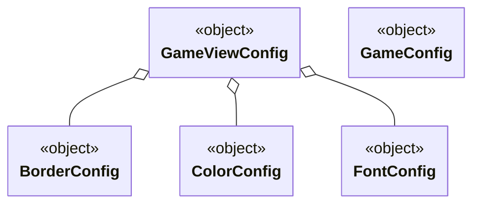

---

title: GameConfig
nav_order: 3
parent: Implementazione

---

# GameConfig



## GameConfig

`GameConfig` è un oggetto creato per contenere valori costanti per il *model* in base alle regole del gioco. Oltre a
valori costanti di tipi primitivi, contiene anche delle **functions** per fornire dei valori costanti in base a uno o
più input. Un esempio di **function** è:
```scala
val PointsPerRouteLength: Int => Int =
  case 1 => 1
  case 2 => 2
  case 3 => 4
  case 4 => 7
  case 6 => 15
  case 8 => 21
  case _ => throw new NoSuchElementException("Unexpected route length.")
```

## GameViewConfig

`GameViewConfig` è un oggetto creato per contenere valori costanti per la *view*. Come `GameConfig` contiene valori
costanti di tipi primitivi e **functions**. Un esempio di **function** è:
```scala
val ObjectiveDescription = (city1: String, city2: String, points: Int) =>
  f"Connect the cities $city1 and $city2\n\nPoints: $points"
```
Innestati in `GameViewConfig` sono presenti gli oggetti `BorderConfig`, `ColorConfig` e `FontConfig`, che contengono
valori costanti specifici rispettivamente per la configurazione di bordi, di colori e di font.