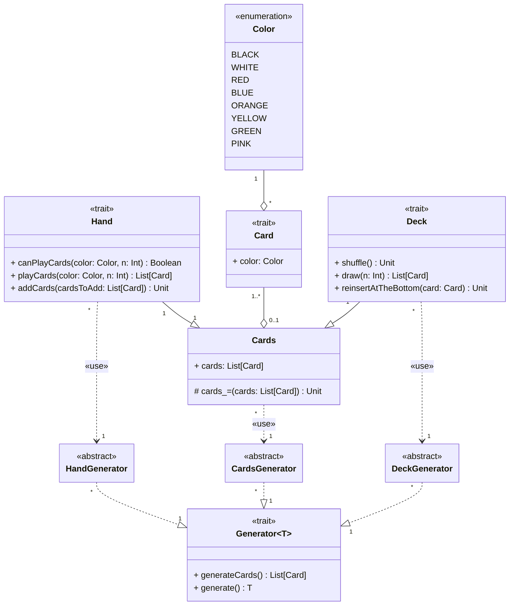

---

title: Cards
nav_order: 1
parent: Implementazione Pracucci Filippo

---

# Implementazione carte

## Cards

La gestione di una lista di carte (`List[Card]`) viene lasciata ad una classe `Cards`, la quale espone pubblicamente un
getter e dispone di un setter protected, in modo da consentire la modifica manuale solo a chi eredita la classe, per
esempio `Deck` e `Hand`. La creazione della lista di carte viene realizzata tramite il metodo `generateCards()` del
`CardsGenerator`. L'entità `Cards` gestisce le carte come una lista in modo da avere massima facilità ed efficienza
nelle operazioni di prelievo dalla cima, ovvero le più effettuate, specialmente dal `Deck`, e reinserimento in cima,
per cui si utilizza il metodo `prepend` al posto di `append`, ad eccezione del metodo `reinsertAtTheBottom()` di `Deck`.

## Generator

Si tratta di un trait generico in `T` con `Cards` come **upperbound**, dato che oltre al metodo `generate(): T`,
definisce un metodo `generateCards()`, che genera una lista di `Card`; quindi si limita l'istanziazione di `T`. Il
generatore viene implementato parzialmente con delle classi astratte, come `CardsGenerator`, per il tipo desiderato,
nelle quali si implementa il metodo `generate()`. Il metodo `generateCards` viene implementato tramite
**given instance** del tipo della classe astratta corrispondente; in questo modo è possibile modificare la modalità di
creazione della lista semplicemente passando un diverso **context** al momento della creazione dell'istanza.

## Deck

Il mazzo di carte viene realizzato estendendo `Cards` e creato fornendo una **given instance** di `DeckGenerator`,
ovvero la classe astratta che implementa parzialmente `Generator[Deck]`, nella quale si effettua l'override del metodo
`generate()`. Una **given instance** standard è stata realizzata per permettere la creazione del `Deck` seguendo le
regole del gioco e si utilizza come **context** nel caso non venga specificato in fase di creazione del mazzo. La
creazione dell'oggetto `Deck`, all'interno del metodo `apply`, viene realizzata quindi tramite il metodo `generate()`
del generatore passato come **context**.

## Hand

Il concetto di `Hand` viene realizzato estendendo `Cards` e creato fornendo una **given instance** di `HandGenerator`,
ovvero la classe astratta che implementa parzialmente `Generator[Hand]`, nella quale si effettua l'override del metodo
`generate()`. Una **given instance** standard è stata realizzata per permettere la creazione della `Hand` del giocatore
seguendo le regole del gioco e si utilizza come **context** nel caso non venga specificato in fase di creazione della
mano. La creazione dell'oggetto `Hand`, all'interno del metodo `apply`, viene realizzata quindi tramite il metodo
`generate()` del generatore passato come **context**.
