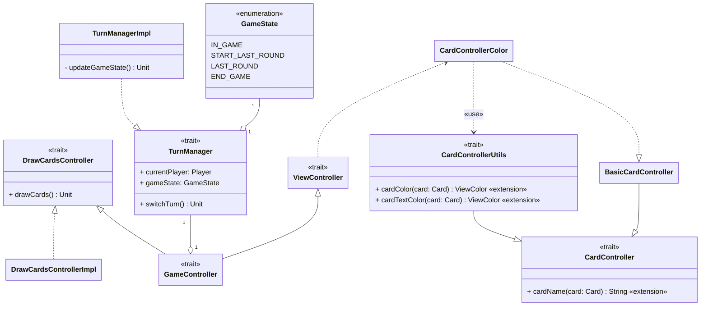

---

title: Controller Pracucci
nav_order: 3
parent: Implementazione Pracucci Filippo

---

# Implementazione controller Pracucci



## TurnManager e TurnManagerImpl

`TurnManagerImpl` è l'implementazione del trait `TurnManager` fornita dal suo **companion object**, in cui si mantiene
un riferimento al giocatore di turno, tramite un setter privato ed un getter pubblico per consentire a chiunque il suo
reperimento. Inoltre viene mantenuto il riferimento allo stato della partita, ovvero un `GameState`, che è
un'enumerazione con tutti i possibili stati:
- `IN_GAME`: stato normale durante la partita;
- `START_LAST_ROUND`: stato che indica l'inizio dell'ultimo round di gioco, ovvero un ultimo round per ogni giocatore;
questo è utile per mostrare un messaggio informativo ai giocatori;
- `LAST_ROUND`: stato che indica il fatto che ci si trovi nell'ultimo turno di un giocatore;
- `END_GAME`: stato che indica il termine della partita.

Infine è presete un metodo `switchTurn` che consiste nella chiamata di un ulteriore metodo privato `updateGameState` e
nell'aggiornamento del giocatore di turno, passando a quello successivo nella lista. Il metodo `updateGameState` come
mostrato:
```scala
private def updateGameState(): Unit =
    import config.GameConfig.TrainsToStartLastRound
    _playerStartedLastRound match
    case Some(player) => _gameState = if currentPlayer == player then END_GAME else LAST_ROUND
    case None if currentPlayer.trains <= TrainsToStartLastRound =>
        _gameState = START_LAST_ROUND
        _playerStartedLastRound = Option(currentPlayer)
    case _ => _gameState = IN_GAME
```
effettua un **match-case** sulla variabile contenente l'`Option` del giocatore che ha iniziato l'ultimo round e nel caso
questo non sia vuoto allora il `GameState` viene modificato a `END_GAME` se il giocatore di turno coincide con colui
che ha iniziato l'ultimo round, altrimenti a `LAST_ROUND`. Mentre nel caso in cui l'`Option` sia vuoto il `GameState`
viene modificato a `START_LAST_ROUND` se il numero di treni rimasti al giocatore di turno è inferiore al limite
presente nel regolamento, altrimenti rimane `END_GAME`.

## DrawCardsControllerImpl

`DrawCardsControllerImpl` è l'implementazione del trait `DrawCardsController` fornita dal suo **companion object**, in
cui viene effettuato l'override del metodo `drawCards`. L'implementazione consiste nella chiamata del metodo `drawCards`
del giocatore di turno e si effettua sul risultato, del tipo `Either[GameError, Unit]`, un **match-case** in cui in caso
di risultato positivo (`Right`) si effettua il cambio del turno sia tramite il `TurnManager` che il `ViewController`;
altrimenti si mostra un errore chiamando il metodo `reportError` del `ViewController`.

## CardController

`CardController` viene utilizzato dal `ViewController` per la creazione delle `CardView` di cui si compone la `HandView`
del giocatori, per fornire alla _view_ il nome della carta, il suo colore e il colore da utilizzare per il suo nome.
Il trait `CardController` contiene un unico **extension method** `cardName`, in cui si fornisce il nome della carta su
cui viene chiamato. Il trait `CardControllerUtils` è un **mixin** di `CardController` in quanto lo estende aggiungendo
due **extension method**, già implementati:
- `cardColor`: per convertire il `Color` della carta nel colore per la _view_ di `java.awt.Color`;
- `cardTextColor`: per ottenere il colore da utilizzare nella _view_ per il testo della carta, in base al `Color` della
carta.

Inoltre si realizza una classe privata `BasicCardController` che estende `CardController` fornendo un override di base
di `cardName`, impostando cioè il suo nome alla stringa equivalente al suo colore.
Infine si crea un oggetto `CardControllerColor` che estende la classe privata `BasicCardController` decorandola con
`CardControllerUtils`
