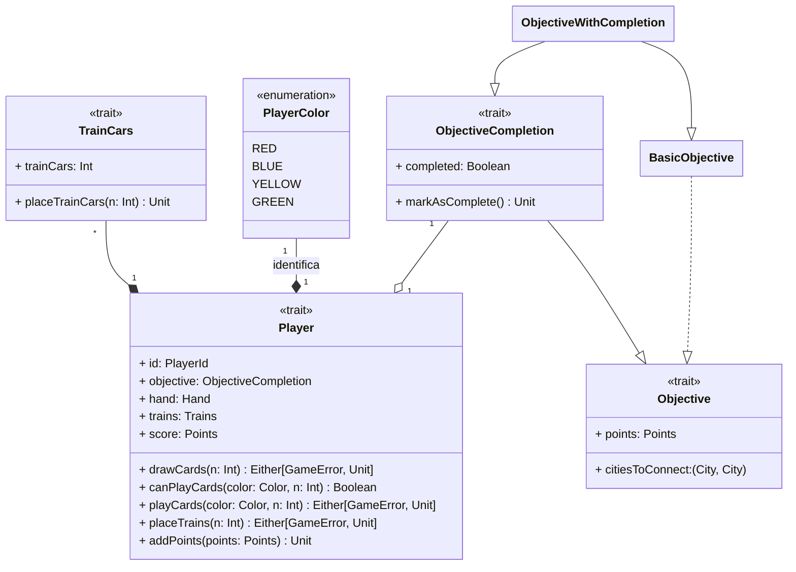

---

title: Player
nav_order: 2
parent: Implementazione Pracucci Filippo

---

# Implementazione giocatore

## Player

Il `Player` viene identificato tramite un `PlayerId` che corrisponde ad un `PlayerColor`, ovvero uno dei colori
riguardanti i giocatori; inoltre gli vengono assegnati un numero di vagoni seguendo le regole del gioco, quindi 45
(come da [requisito di sistema 1.2](../../requirement_specification.md#requisiti-di-sistema)); il tipo `Trains`
corrisponde a `Int`, in quanto si desidera esporre solamente il numero di treni rimasti al giocatore, senza fornire la
possibilità di modificare manualmente la sua quantità, ma solo tramite il metodo `placeTrains` del giocatore. La stessa
cosa viene effettuata con la mano del giocatore, il cui tipo `Hand` corrisponde alla lista di carte che la compongono,
in modo da impedire la sua modifica manualmente, ma esclusivamente tramite i metodi del `Player`. Mentre
lo score del giocatore, del tipo `Points`, equivale ad un `Int` e viene importato da `Objective`. Inoltre gestisce le
azioni che potrebbero fallire a causa di requisiti non soddisfatti (come quantità di vagoni non sufficienti, etc.),
ovvero i metodi `drawCards`, `playCards` e `placeTrains`, utilizzando come tipo di ritorno `Either[GameError, Unit]`.
In questo modo nel caso in cui non sia possibile portare a termine l'azione verrà restituito un `GameError`, nello
specifico uno degli oggetti che estende il trait `GameError` e che rappresenta una tipologia di errore del gioco. Il
metodo `drawCards` affida la responsabilità di pescare le carte dal `Deck`, ovvero di chiamare il relativo metodo
`draw`, al giocatore, in quanto è l'unico ad avere l'istanza del mazzo di gioco; successivamente le carte pescate
vengono aggiunte alla mano del giocatore, sempre tramite la sua chiamata del metodo `addCards` di `Hand`. La scelta di
affidare al `Player` l'istanza del `Deck` deriva dalla volontà di simulare le azioni di gioco reali, dove è il giocatore
a pescare fisicamente le carte dal mazzo di gioco per aggiungerle alla sua mano.

## Objective

`Objective` corrisponde ad una coppia di città, modellate con un tipo `City` che corrisponde al tipo `CityName`
dichiarato in `GameMap`, ed una quantità di punti, modellata con un tipo `Points` che corrisponde a `Int`; lo stesso
tipo viene usato per lo score del giocatore. Il **companion object** di `Objective` oltre al metodo
`apply`, dispone anche del metodo `unapply`, in modo da consentire la scomposizione ed il **pattern matching** delle
sue istanze. Il trait `Objective` viene esteso dal trait `ObjectiveCompletion` con il concetto di completamento.
Si realizza un'implementazione base di `Objective`, ovvero `BasicObjective`; questa viene poi estesa
dall'implementazione `ObjectiveWithCompletion` con l'aggiunta di `ObjectiveCompletion` come **mixin**. Dunque la classe
`ObjectiveWithCompletion` consiste in una decorazione dell'implementazione base dell'obiettivo con il trait del
completamento. Il giocatore utilizzerà un obiettivo del tipo `ObjectiveCompletion`, per poter sfruttare tutte le
funzionalità e semplificare la gestione del completamento.
