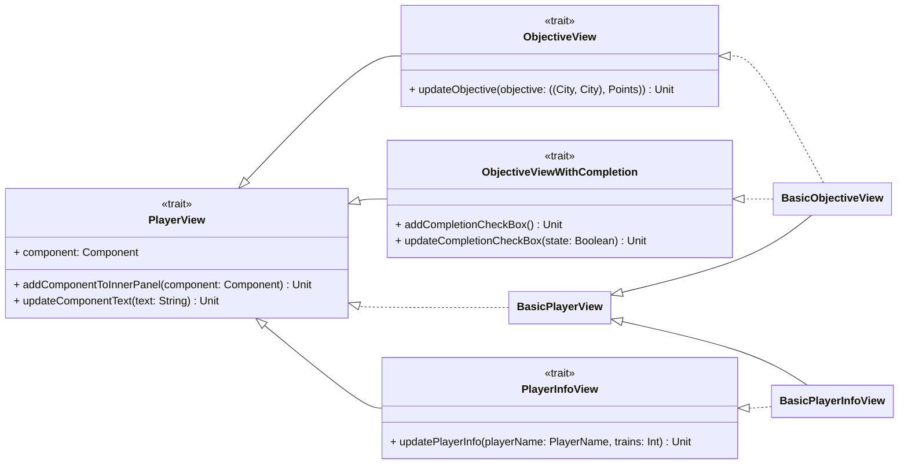

---

title: Player View
nav_order: 3
parent: Implementazione Pracucci Filippo

---

# Implementazione view giocatori

## PlayerView

Il trait `PlayerView` gestisce la view tramite un componente esterno, che in questo caso sarà un `Panel` ed un
componente interno che ha il ruolo di contenere anche il testo che si vuole mostrare. Dunque il metodo
`addComponentToInnerPanel` serve ad impostare la rappresentazione del contenuto vero è proprio del pannello.
Si realizza un'implementazione di base di `PlayerView`, ovvero una classe _protected_ `BasicPlayerView` per limitare la
sua visibilità alle altre view che la estenderanno.

## ObjectiveView e ObjectiveViewWithCompletion

La classe `BasicObjectiveView` consiste in una estensione di `BasicPlayerView` con `ObjectiveView` e
`ObjectiveViewWithCompletion` come **mixin**, decorando il pannello dell'obiettivo con le funzionalità dei trait.
L'obiettivo viene mostrato come coppia formata da `Points` ed una coppia di `City`; dove il tipo `Points` equivale al
tipo `Int`, usato anche per gestire lo score dei giocatori, mentre il tipo `City` equivale alla stringa rappresentante
il nome della città. Il componente relativo all'obiettivo che verrà mostrato nella view è unico, in quanto tramite il
metodo `updateObjective` è possibile aggiornarlo con l'obiettivo del giocatore attualmente di turno, senza dover usare
una collezione di componenti, uno associato ad ogni giocatore.

Se si utilizza anche il mixin per il completamento dell'obiettivo, come nel caso di `BasicObjectiveView`, il checkbox
dell'obiettivo che verrà mostrato nella view è unico, in quanto tramite il metodo `updateCompletionCheckBox` è possibile
aggiornarlo con lo stato dell'obiettivo del giocatore attualmente di turno, senza dover usare una collezione di
componenti, uno associato ad ogni giocatore.

## PlayerInfoView

La classe `BasicPlayerInfoView` consiste in una estensione di `BasicPlayerView` con `PlayerInfoView` come **mixin**,
decorando il pannello delle informazioni del giocatore con le funzionalità del trait. Le informazioni del giocatore
vengono mostrate come una stringa formattata con il nome del giocatore e il numero di vagoni rimasti, dove il nome del
giocatore è del tipo `PlayerName` che equivale a `String`. Analogamente al componente dell'obiettivo si utilizza un
unico componente anche per le informazioni del giocatore, in quanto tramite il metodo `updatePlayerInfo` è possibile
aggiornare le informazioni del giocatore di turno, senza dover fare uso di una collezione di componenti, uno associato
ad ogni giocatore.
