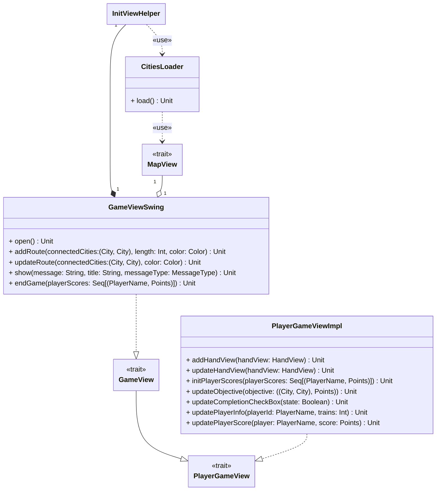

---

title: View
nav_order: 2
parent: Implementazione

---

# Design View

## Scelta libreria grafica

La nostra scelta per la view è ricaduta su `scala.swing`, per la sua semplicità e il fatto che in questo gioco non era
necessaria una particolare resa grafica.

## GameViewSwing

Si tratta di un'estensione di `GameView` utilizzando come **type parameter** `java.awt.Color` per i colori utilizzati
all'interno della view. All'interno del **companion object** di `GameView` il tipo `City` corrisponde a `String`,
`PlayerName` equivale a `String` e `Points` corrisponde a `Int`; inoltre per quanto riguarda i `MessageType` sono
presenti tre tipologie: `Info`, `Error` e `Response` per rappresentare rispettivamente messaggi informativi, di errore e
di risposta ad azioni del giocatore.

L'inizializzazione delle varie parti che compongono la _view_ è delegata ad un'istanza di `InitViewHelper`.

I metodi implementati sono:
- `show`: visualizza tutti i messaggi tramite **dialog**, differenziandoli in base al `MessageType`;
- `endGame`: mostra un **dialog** di fine partita in cui si mostra la possibilità di visualizzare la classifica finale
ed in caso positivo si chiude la finestra di gioco e se ne mostra una per visualizzare la classifica, tramite un'istanza
di `FinalRankingView`.

Mentre gli altri metodi si ottengono tramite **export** da `MapView` e `PlayerGameView`.

## InitViewHelper

Si tratta di una classe per il supporto alla creazione e configurazione della _view_, intesa come insieme di **panel**.
Le dimensioni del **frame** vengono impostate in base alla dimensione dello schermo dell'utente.
I pannelli principali che compongono l'interfaccia sono:
- `southPanel`: contenente i pulsanti per mostrare le regole e pescare dal mazzo, oltre all'`HandView` del giocatore di
turno, la quale è inserita all'interno di un `ScrollPane` in modo da consentire lo scorrimento in caso siano presenti
molte carte;
- `eastPanel`: contenente dei pannelli innestati per `PlayerInfoView`, `ObjectiveViewWithCompletion` e
`PlayerScoresView`.

Nel resto della schermata è visualizzata la mappa di gioco, la quale viene inizializzata tramite un'istanza di
`CitiesLoader` che si occupa di inserire tutte le città caricate da file nella mappa.

Si impostano i **listeners** e le **reactions** dei pulsanti per visualizzare le regole e per il pescaggio; questi
ultimi segnalano le richieste al `GameController`.

## PlayerGameViewImpl

Alla classe in fase di creazione vengono passate tutte le _view_ necessarie per la gestione delle informazioni dei
giocatori, effettuando l'**export** di alcuni metodi, laddove necessario, mentre si implementano i metodi:
- `addHandView`: aggiunge al **panel** della mano il componente della `HandView` fornita;
- `updateHandView`: pulisce il contenuto del **panel** della mano, per poi chiamare `addHandView` passando l'`HandView`
aggiornata, infine aggiorna il **frame**.
