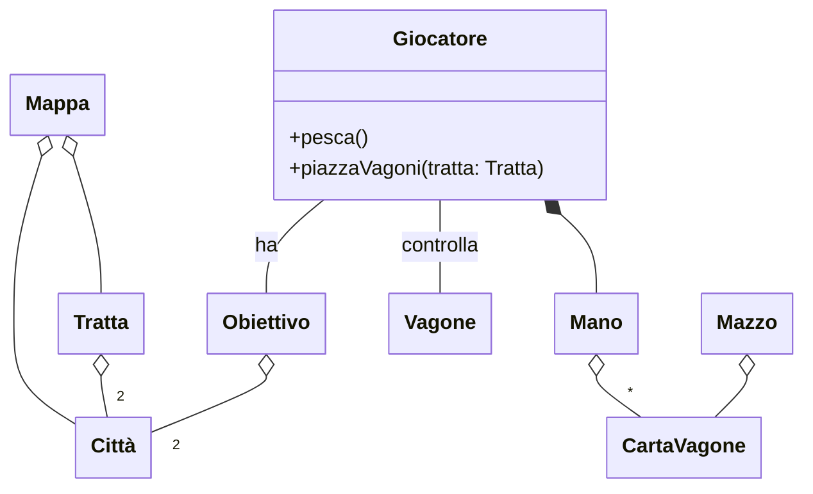
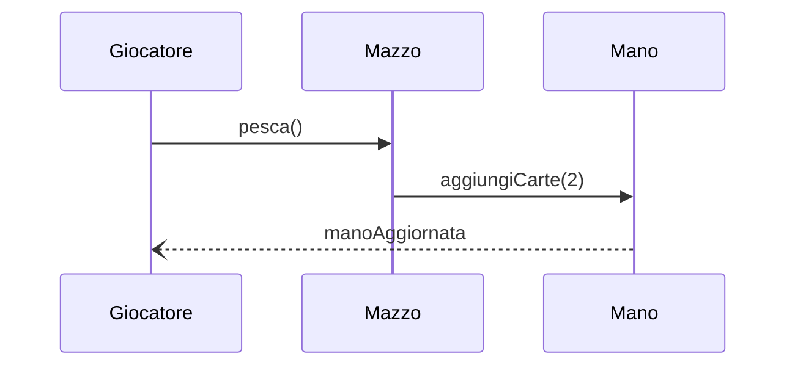
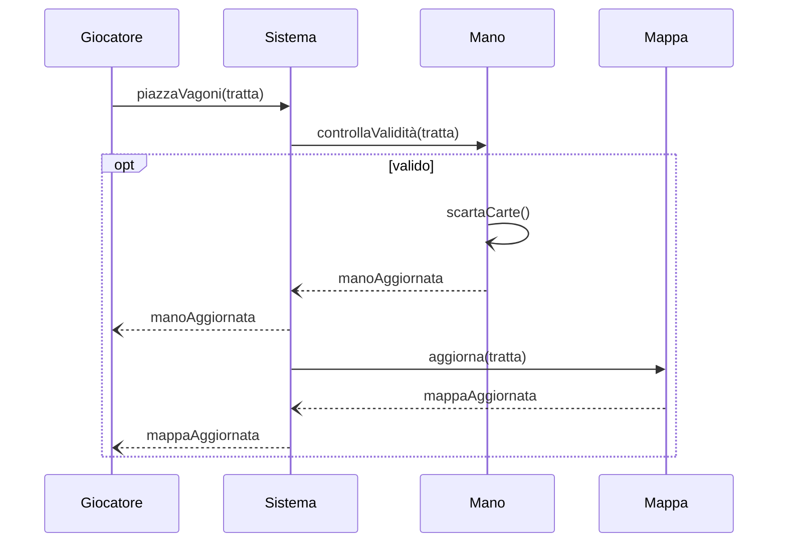

---

title: Requirement specification
nav_order: 2
parent: Report

---

# Requirement Specification

## Requisiti di business

[Da rivedere e completare nel caso si utilizzi Prolog ed eventualmente con altri aspetti avanzati usati.]: #

I principali obiettivi posti dalla realizzazione del progetto sono:

- consolidare le competenze acquisite durante il corso, utilizzando tecniche avanzate di Scala, per esempio mixins, monads, etc;
- sfruttare il Test Driven Development (TDD) durante lo sviluppo;
- sperimentare tecniche e modalità di gestione del processo di sviluppo del progetto, come GitFlow, GitHub Actions, CI/CD, etc;
- completare il progetto in maniera conforme con le specifiche dell'esame.

Si riterranno soddisfatti i suddetti requisiti di business se:

- sono stati inseriti elementi avanzati di Scala all'interno del progetto;
- ogni funzionalità è verificabile tramite i test specifici realizzati seguendo il TDD;
- il lavoro sul repository è stato suddiviso in diversi branch, con il branch main che contiene solo le versioni stabili;
- sono stati realizzati tutti i workflow per la CI/CD;
- la consegna del progetto è avvenuta entro la scadenza prefissata.

## Modello di dominio

Gli elementi principali che compongono il sistema sono:

- **Mappa**: tabellone di gioco composto da un grafo di città collegate da tratte ferroviarie.
- **Tratta**: collegamento ferroviario tra due città, di una determinata lunghezza e colore.
- **Città**: punti che definiscono le partenze e gli arrivi delle tratte e degli obiettivi.
- **Obiettivo**: coppia di una città di partenza e una di arrivo da collegare per ottenere un determinato numero di punti.
- **Vagone**: marcatore utilizzato per occupare una tratta, di cui è necessaria una quantità pari alla lunghezza della tratta.
- **Mano**: insieme delle carte vagone possedute da un giocatore.
- **Carta vagone**: carte caratterizzate da un colore, utilizzabili per occupare una tratta.
- **Mazzo**: insieme delle carte vagone.
- **Giocatore**: entità che ha un obiettivo da completare e dei vagoni posizionabili per occupare le tratte. Può
  effettuare due azioni: `pesca` per pescare due carte dal mazzo ed aggiungerle alla propria mano; `piazzaVagoni` per
  occupare la tratta specificata posizionandoci i propri vagoni.

Si modella tramite un diagramma di sequenza la procedura per pescare le carte dal mazzo ed aggiungerle alla mano
del giocatore.

Si modella tramite un diagramma di sequenza la procedura per provare ad occupare una tratta posizionando i propri vagoni.
Il sistema è incaricato di controllare la validità delle carte nella mano del giocatore in base alla tratta scelta, e
in caso di esito positivo aggiornare la mappa di gioco.

## Requisiti funzionali

[Possibilità di aggiungere una breve spiegazione e dettagliare maggiormente i requisiti]: #

### Requisiti utente

1. la mappa deve essere visualizzata dal giocatore come un insieme di città collegate tramite tratte ferroviarie di diverse
lunghezze ed ognuna caratterizzata da un colore; il giocatore ha la possibilità di scegliere quale tratta occupare;
2. i giocatori devono poter visualizzare lo stato della mappa, cioè le tratte libere e quelle occupate;
3. ad ogni turno il giocatore deve avere la possibilità di scegliere se pescare due carte vagone dal mazzo o occupare una tratta;
4. il giocatore per occupare una tratta di un determinato colore deve utilizzare un numero di carte vagone dello stesso
colore pari alla lunghezza della tratta;
5. al giocatore deve essere consegnata una carta obiettivo, che consiste in una città di partenza e una di arrivo da collegare,
la quale deve essere sempre visualizzabile per il giocatore;
6. il giocatore ad ogni turno deve poter visualizzare la propria mano di gioco, composta dalle carte vagone che possiede;
7. i giocatori devono avere la possibilità di controllare il numero di vagoni rimanenti che possono essere posizionati;
8. i giocatori devono poter visualizzare la situazione dei punteggi di tutti i giocatori.

I sopracitati requisiti utente vengono validati tramite User Acceptance Tests.

### Requisiti di sistema

1. il sistema deve gestire l'avvio della partita assegnando:
    1. un numero predefinito (4) di carte vagone casuali;
    2. un numero predefinito (45) di vagoni posizionabili per controllare le tratte;
   3. una carta obiettivo casuale;
2. il sistema deve decidere casualmente il giocatore di partenza;
3. il sistema deve assegnare al giocatore che occupa una tratta i punti corrispondenti, a seconda della lunghezza della tratta,
e quando termina l'obiettivo;
4. il sistema deve poter accedere alle decisioni di configurazione, come la mappa di gioco e le carte obiettivo.

I sopracitati requisiti di sistema vengono validati tramite test automatizzati.

## Requisiti non funzionali

[Questi requisiti sono in fase di draft, da essere revisionati]: #
1. **Performance**: il tempo di risposta di un'azione dell'utente non deve superare i X ms, su una determinata architettura.
2. **Portabilità**: il gioco deve funzionare su diverse piattaforme (Windows, Linux e MacOS). 
3. **Usabilità**: il gioco deve essere intuitivo.

I sopracitati requisiti non funzionali vengono validati tramite User Acceptance Tests e Stress Tests.

## Requisiti di implementazione

1. Utilizzo di Scala come linguaggio di programmazione;
2. utilizzo di Git come VCS;
3. deve essere presente la documentazione (Scaladoc) per ogni API pubblica.

[DA COMPLETARE (qualità interna)]: #
